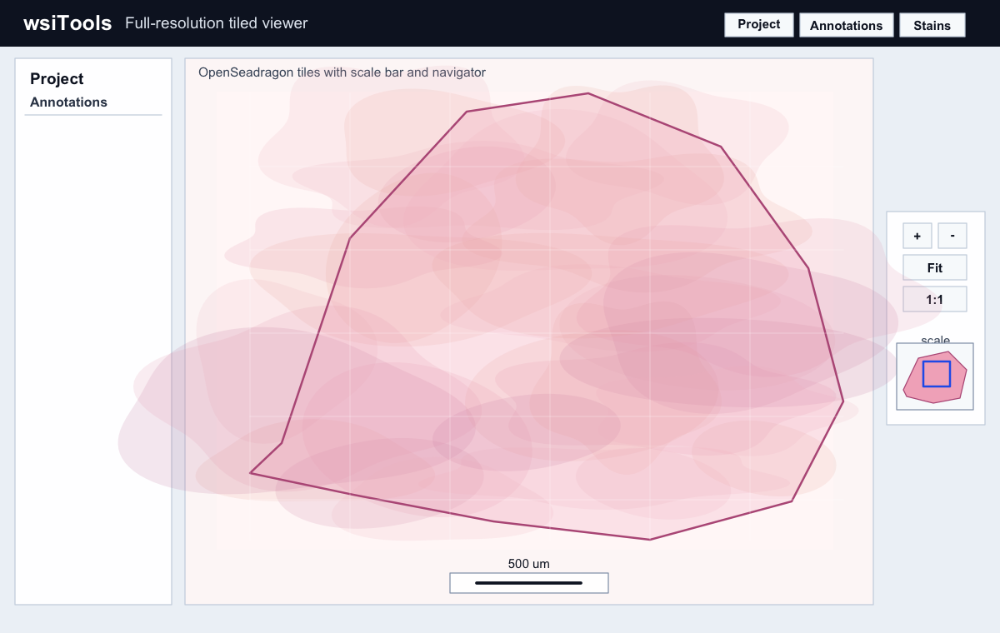
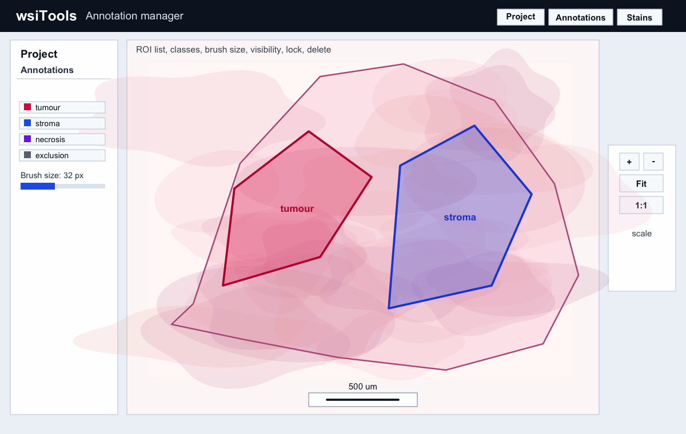
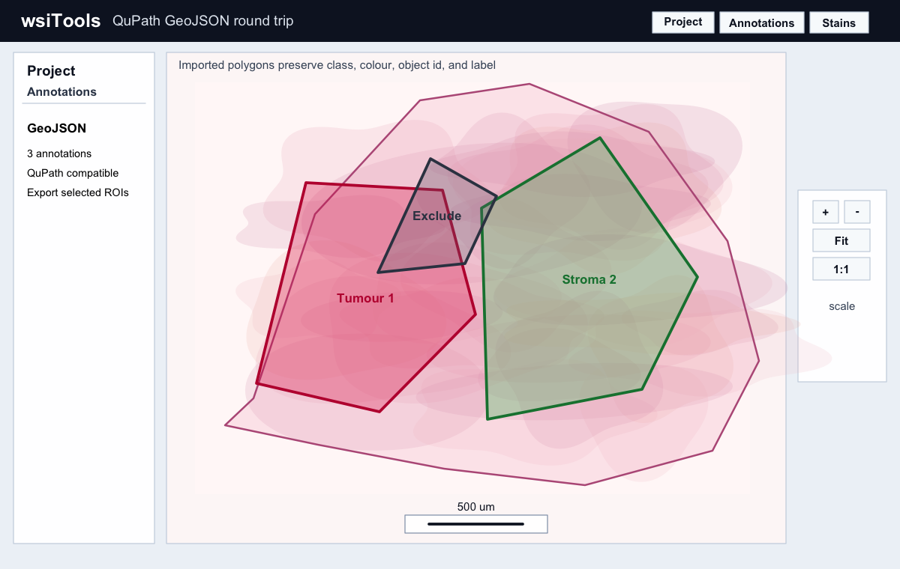
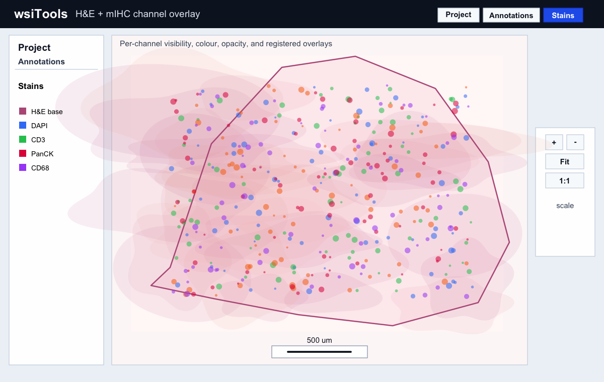
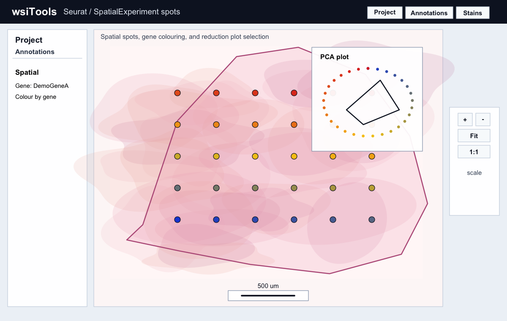
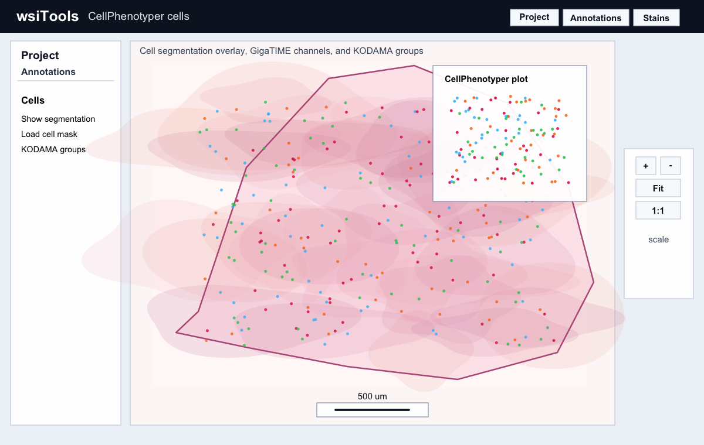
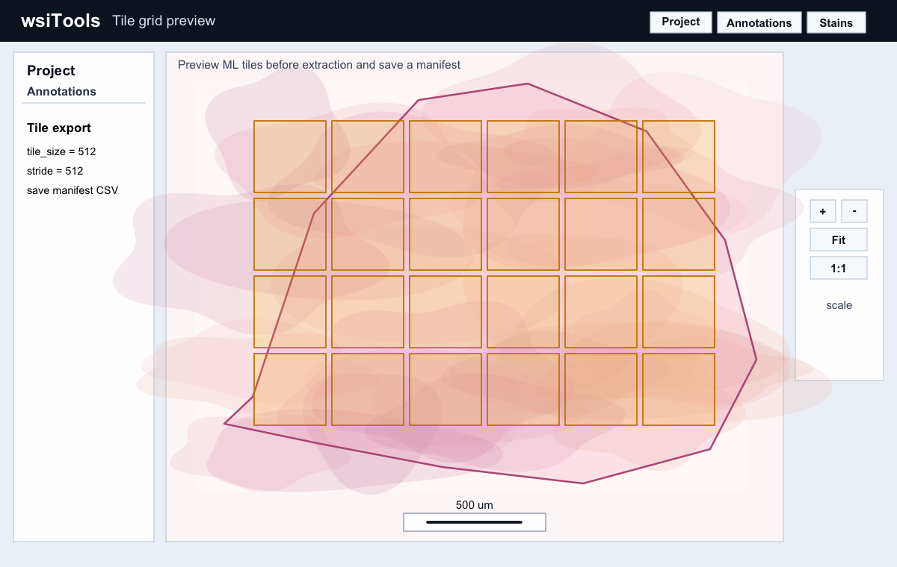
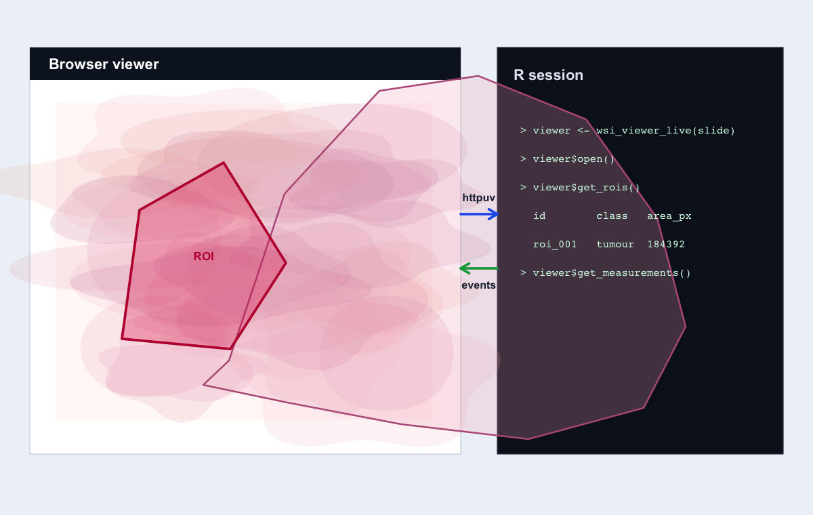
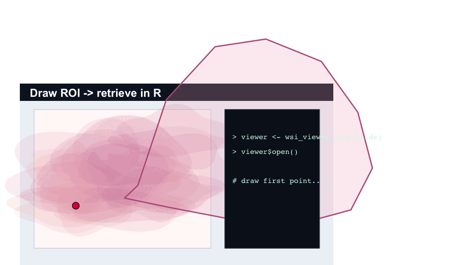

# wsiTools

[](https://github.com/tkcaccia/wsiTools/actions/workflows/R-CMD-check.yaml)
[](https://lifecycle.r-lib.org/articles/stages.html)
[](LICENSE)
[](https://github.com/tkcaccia/wsiTools/releases)
[](https://tkcaccia.github.io/wsiTools/)

wsiTools is an R toolkit for memory-efficient WSI access and preprocessing
through region-based reading, tiling, pyramidal image handling, conversion and
export.

Whole-slide images can be extremely large, so wsiTools is designed around
backend metadata, pyramid levels, explicit region reads, tile manifests, and
streaming conversion. It does not load complete level-0 slides into R memory by
default.

## What wsiTools is / is not

wsiTools is:

- an R toolkit for memory-efficient WSI access and preprocessing;
- a live R-connected pathology viewer;
- a bridge between WSI, annotations, spatial omics, and CellPhenotyper.

wsiTools is not:

- a package that loads whole-slide images fully into R memory;
- a replacement for all QuPath functionality;
- a package that bundles every external backend automatically.

## Format support

Format support depends on the installed backend, the exact file variant, and the
metadata written by the scanner or converter. wsiTools reports backend
availability and should fail with informative errors rather than claiming that
every WSI or microscopy format is guaranteed to work.

| Format | Recommended backend | Status |
| --- | --- | --- |
| SVS | OpenSlide/libvips | supported when backend available |
| NDPI | OpenSlide | backend-dependent |
| SCN | OpenSlide | backend-dependent |
| MRXS | OpenSlide | backend-dependent |
| OME-TIFF | libvips/Bio-Formats | backend-dependent |
| CZI | native CZI/Bio-Formats | improving |
| DICOM WSI | backend-dependent | experimental |

Check your machine with:

```r
wsi_backends()
wsi_diagnose(live_test = FALSE)
```

## Start here

```r
remotes::install_github("tkcaccia/wsiTools", upgrade = "never")

library(wsiTools)
wsi_start()
wsi_backends()

viewer <- wsi_open_viewer("sample.svs")
```

No sample slide yet? Run the lightweight built-in demo:

```r
demo <- wsi_demo_viewer(open = TRUE)
demo$path
```

- Static viewer: writes an HTML viewer, but does not send automatic feedback
  back to R.
- Live viewer: opens a browser connected to the active R session through
  `httpuv`, so annotations, selections, measurements, and other events can be
  retrieved from R.
- Full-resolution viewing: use tiled mode through OpenSeadragon; the browser
  needs image tiles rather than raw SVS, CZI, or OME-TIFF pixels.
- Optional tools: StarDist, Mesmer, OpenSlide, libvips, Bio-Formats, and
  libCZI are runtime capabilities. They are not installed silently with the
  core R package.

For the shortest image-opening workflow, see [open one image](docs/open-one-image.md).
For screenshots and the ROI round-trip GIF, see the
[visual gallery](docs/screenshots.md). For copy-paste workflows, see the
[examples gallery](docs/examples.md); the older [examples page](EXAMPLES.md)
contains longer notes. For
installation on Windows, macOS, Ubuntu, and optional runtime tools, see the
[installation guide](docs/installation.md) and [backend setup guide](docs/backends.md).
For browser-to-R synchronization, remote desktops, SSH tunnels, and common live
viewer mistakes such as opening `/viewer-state` instead of the HTML viewer, see
the dedicated [live viewer guide](docs/live-viewer.md). For a compact diagram
of the R session, browser viewer, OpenSeadragon tiles, and runtime backends, see
[architecture](docs/architecture.md). For known installation,
backend, and viewer errors, see [troubleshooting](docs/troubleshooting.md).
For Seurat, Giotto, SpatialExperiment, and CellPhenotyper workflows, see
[spatial omics](docs/spatial-omics.md).
For optional selected-ROI StarDist, Mesmer, mask import, and cell export
workflows, see [cell segmentation](docs/cell-segmentation.md).
For the `.wsiproject` directory layout and saved analysis state, see
[project format](docs/projects.md).
These pages cover
single-image viewing, CZI projects, H&E/mIHC overlays, CellPhenotyper,
Seurat/Visium PCA, annotation round trips, tile extraction, conversion, and
troubleshooting.

## Visual preview

These previews are generated from synthetic demo data and are safe to keep in
the repository. They show the main viewer workflows without committing any large
or identifiable slide data.

| Full-resolution viewer | Annotation panel |
| --- | --- |
|  |  |

| GeoJSON overlay | mIHC channel overlay |
| --- | --- |
|  |  |

| Spatial spots | CellPhenotyper cells |
| --- | --- |
|  |  |

| Tile grid | Live R synchronization |
| --- | --- |
|  |  |

ROI drawing and R round trip:



## Installation

### Quick install from GitHub

Start with the lightweight R package. This installs the core package only;
large WSI backends are checked at runtime and are not downloaded silently.

```r
install.packages("remotes", repos = "https://cloud.r-project.org")

remotes::install_github(
  "tkcaccia/wsiTools",
  upgrade = "never",
  build_vignettes = FALSE,
  force = TRUE
)

library(wsiTools)
packageVersion("wsiTools")
wsi_backends()
wsi_diagnose(live_test = FALSE)
```

The current GitHub package version is `0.1.23`. Avoid installing old commit
references unless you are deliberately debugging a previous build; the command
above always reinstalls the current GitHub version.

From a local checkout:

```r
install.packages(".", repos = NULL, type = "source")
```

The current GitHub package is designed to install without OpenSlide, libvips,
Python, Bio-Formats, or OME-Zarr pixel readers. It now includes a small
compiled native bridge so Windows source installs need the usual Rtools
toolchain; OpenSlide, libvips, Bio-Formats, and libCZI remain optional runtime
capabilities rather than mandatory package dependencies.

### Windows clean reinstall

If a previous installation was interrupted, remove the stale lock and retry:

```r
lib <- Sys.getenv("R_LIBS_USER")
unlink(file.path(lib, "00LOCK-wsiTools"), recursive = TRUE, force = TRUE)
unlink(file.path(lib, "wsiTools"), recursive = TRUE, force = TRUE)

remotes::install_github(
  "tkcaccia/wsiTools",
  upgrade = "never",
  build_vignettes = FALSE,
  force = TRUE,
  INSTALL_opts = "--no-multiarch"
)
```

If R asks whether to update packages, choose `3: None` unless you deliberately
want to update your local package library. This avoids accidental long updates
on managed Windows workstations.

After installation, check `packageVersion("wsiTools")`. It should report
`0.1.23` or newer. On Windows, the native CZI bridge is compiled by default.
If you need to install only the core package on a machine where that native
bridge cannot compile, set `WSITOOLS_DISABLE_NATIVE_CZI=1` before installation
to use the fallback stub.

### Optional viewer packages

The package loads without these, but the live viewer and previews are more
useful when they are installed:

```r
install.packages(
  c("magick", "httpuv", "callr"),
  repos = "https://cloud.r-project.org"
)
```

Use `sf` only if you need polygon-aware spatial operations:

```r
install.packages("sf", repos = "https://cloud.r-project.org")
```

## System dependencies

wsiTools can be installed without WSI system libraries, but backend-dependent
functions need the corresponding tools at runtime:

- OpenSlide command-line tools for OpenSlide-backed metadata and region reads.
- libvips command-line tools (`vips`, `vipsheader`) for conversion, pyramids,
  thumbnails, cropping, and export.
- Bio-Formats command-line tools (`showinf`, `bfconvert`) for optional
  microscopy format metadata, CZI inspection, and conversion workflows. They
  are not used for first visualization of CZI files.
- ZEISS libCZI/libCZIAPI for direct CZI first visualization without Python.
  Set `WSITOOLS_LIBCZIAPI` when the shared library is not already discoverable.
- Cell segmentation model stacks remain optional. wsiTools can open
  CellPhenotyper projects and visualize their cell overlays; live viewers can
  also orchestrate configured external StarDist/Mesmer commands on selected
  ROI crops.
- `httpuv`, `magick`, and `sf` are optional R packages used only for live viewer
  bridges, image previews, and polygon-aware ROI operations.
- `callr` is optional and is used only when non-blocking background jobs are
  requested.
- OME-Zarr metadata reading is lightweight; full chunked pixel decoding should
  remain an optional backend capability.

Check your local capabilities after installing:

```r
library(wsiTools)
wsi_backends()
```

New users can ask wsiTools for a setup plan. This is the recommended second
step after installation:

```r
plan <- wsi_setup()
plan
```

This reports missing optional R packages and system tools, and prints copyable
commands for Homebrew, apt, dnf, or conda when one is detected. It does not
install anything unless you explicitly opt in:

```r
# Review the plan first
wsi_setup()

# Show the install plan without running it
wsi_install_backends(install = FALSE)
```

### Automatic optional backend installer

`wsi_install_backends()` is the convenience helper for first-time setup. It can
install optional R packages such as `magick`, `httpuv`, and `callr`, and it can
run supported system package managers for tools such as libvips, OpenSlide, and
ImageMagick. These tools are optional runtime backends: wsiTools never installs
them silently during `install.packages()` or `remotes::install_github()`.

```r
library(wsiTools)

# Recommended: inspect what is missing first
wsi_setup()

# Let wsiTools choose a supported installer for this platform
wsi_install_backends(method = "auto")

# macOS with Homebrew
wsi_install_backends(method = "homebrew")

# Ubuntu/Debian. sudo is never used unless you opt in.
wsi_install_backends(method = "apt", allow_sudo = TRUE)

# Fedora
wsi_install_backends(method = "dnf", allow_sudo = TRUE)

# Windows pieces supported by winget
wsi_install_backends(
  tools = c("libvips", "imagemagick"),
  method = "winget"
)

# Conda or mamba environment
wsi_install_backends(
  tools = c("openslide", "libvips", "imagemagick", "bioformats"),
  method = "conda"
)

# Optional native CZI reader. This builds ZEISS libCZI/libCZIAPI in
# the user cache after you explicitly accept the libCZI license notice.
wsi_install_native_czi(install = FALSE)          # inspect commands first
wsi_install_native_czi(
  accept_license = TRUE,
  ask = FALSE,
  persist = TRUE
)
```

In interactive R sessions, wsiTools asks before running system commands. On
Debian/Ubuntu or Fedora, system installs may require `sudo`; wsiTools will not
run those commands unless you explicitly set `allow_sudo = TRUE`. Restart R or
RStudio after installing system tools, then check:

```r
wsi_backends()
```

OpenSlide on Windows is still best installed through conda-forge, MSYS2/vcpkg,
or the official binary distribution, then added to `PATH`. The winget helper is
useful for libvips and ImageMagick, but it does not currently install OpenSlide
for Windows.

### Installing CZI first-visualization support

CZI visualization uses a tile/region reader, not `bfconvert`. wsiTools now
gives OpenSlide and libvips first refusal for CZI variants they can already
read, because these backends are fast and tile-friendly. If neither can open
the file, wsiTools tries direct calls to ZEISS libCZI/libCZIAPI from the
package's native code. As an alternative, wsiTools can use a small optional
Bio-Formats Java helper that calls Bio-Formats `ImageReader` region APIs for
metadata and low-resolution scene previews. The Python wrapper path is kept only
as a legacy fallback and is not used unless you explicitly set
`WSITOOLS_CZI_ALLOW_PYTHON=true`.

The easiest route is the explicit native CZI setup helper. It does not bundle
libCZI inside wsiTools; it downloads/builds ZEISS libCZI/libCZIAPI into your
user cache, then sets `WSITOOLS_LIBCZIAPI` for the current R session. Use
`persist = TRUE` to save that path in `~/.Renviron` for future R sessions.

```r
# Review the download/configure/build commands without running them.
wsi_install_native_czi(install = FALSE)

# Build and activate the native CZI backend.
# Requires git, cmake, and a working C/C++ toolchain.
native <- wsi_install_native_czi(
  accept_license = TRUE,
  ask = FALSE,
  persist = TRUE
)
native

wsi_has_native_czi()
wsi_backends()
wsi_viewer_project("sample.czi", open = TRUE)
```

If you already installed libCZIAPI yourself, set the shared library path
manually instead:

```r
Sys.setenv(WSITOOLS_LIBCZIAPI = "/path/to/libCZIAPI.dylib") # macOS
# Sys.setenv(WSITOOLS_LIBCZIAPI = "/path/to/libCZIAPI.so")  # Linux
# Sys.setenv(WSITOOLS_LIBCZIAPI = "C:/path/to/libCZIAPI.dll") # Windows
```

To use the Bio-Formats Java helper instead of `bfconvert`, install Java plus
the Bio-Formats JAR, then point wsiTools at it:

```r
Sys.setenv(WSITOOLS_BIOFORMATS_JAR = "/path/to/bioformats_package.jar")
# Optional if java/javac are not on PATH:
# Sys.setenv(WSITOOLS_JAVA = "/path/to/java")
# Sys.setenv(WSITOOLS_JAVAC = "/path/to/javac")

wsi_backends()
wsi_viewer_project("sample.czi", open = TRUE)
```

This helper compiles a tiny Java class into R's temporary directory and reads
only requested regions with Bio-Formats; it does not batch-convert the full CZI.

The native bridge currently supports CZI metadata, basic dimensions, and
single-channel/RGB preview regions through libCZIAPI. More complete scene,
channel, and high-resolution dynamic-tile support can be built on the same
bridge.

CZI project viewing opens a low-resolution scene preview first. By default
wsiTools caps the first preview to about 1024 px on the longest side and, when
libCZI reports pyramid layers, selects the most downsampled native layer that is
still useful for navigation. This keeps first open responsive; higher-resolution
region or tiled access can be requested later.

```r
# Optional tuning for the first CZI overview.
Sys.setenv(WSITOOLS_CZI_INITIAL_PREVIEW_WIDTH = "1024")
Sys.setenv(WSITOOLS_CZI_MIN_PREVIEW_WIDTH = "768")
```

Only use the Python wrapper if native libCZIAPI is not available and you choose
to enable that fallback:

```r
Sys.setenv(WSITOOLS_CZI_ALLOW_PYTHON = "true")
Sys.setenv(WSITOOLS_CZI_PYTHON = "/path/to/wsitools-czi/bin/python")
wsi_has_czi_python()
```

One simple Python fallback setup is a small conda environment:

```sh
conda create -n wsitools-czi --override-channels -c conda-forge python pip
conda activate wsitools-czi
python -m pip install aicspylibczi numpy pillow
python -c "import aicspylibczi, numpy, PIL"
```

Then point wsiTools to that Python executable and opt in before opening the
viewer:

```r
Sys.setenv(WSITOOLS_CZI_ALLOW_PYTHON = "true")
Sys.setenv(WSITOOLS_CZI_PYTHON = "/path/to/wsitools-czi/bin/python")
wsi_has_czi_python()
wsi_viewer_project("sample.czi", open = TRUE)
```

On Windows the Python path is usually similar to
`C:/Users/<you>/miniconda3/envs/wsitools-czi/python.exe`.

### Installing Bio-Formats

Bio-Formats is optional. wsiTools can use it in two ways:

- Java helper for first visualization and region previews via
  `ImageReader`/region reads when `WSITOOLS_BIOFORMATS_JAR` points to
  `bioformats_package.jar`.
- Command-line tools `showinf` and `bfconvert` for metadata and conversion
  workflows.

Installing the Bio-Formats plugin inside Fiji/ImageJ is useful for Fiji, but it
is not enough for wsiTools unless the JAR or command-line tools are also visible
to R.

The simplest route is usually conda:

```sh
conda create -n wsitools-bioformats --override-channels -c ome -c conda-forge bftools
conda activate wsitools-bioformats
showinf -version
bfconvert -version
```

The `--override-channels` flag prevents conda from also consulting Anaconda's
default channels. This avoids `CondaToSNonInteractiveError` on machines where
the Anaconda default-channel Terms of Service have not been accepted. If your
institution requires the Anaconda default channels, accept the Terms of Service
in Anaconda Prompt using the `conda tos accept ...` commands printed by conda,
then retry.

If you already use conda for R, you can install into the active environment
from R:

```r
wsi_install_backends(
  tools = "bioformats",
  method = "conda"
)

wsi_backends()
```

If you use RStudio outside conda, launch RStudio from the activated conda
environment, or add the conda environment tools directory to `PATH` before
starting R. On macOS/Linux this is usually the environment's `bin` directory;
on Windows it is usually `Scripts` or `Library/bin`.

Manual install from the official OME download is also reliable:

1. Install Java if `java -version` is not available.
2. Download `bftools.zip` from the
   [OME Bio-Formats downloads page](https://www.openmicroscopy.org/bio-formats/downloads/).
3. Unzip it to a permanent folder, for example `~/tools/bftools` or
   `C:\Users\<you>\tools\bftools`.
4. Add that folder to `PATH`.
5. Restart R/RStudio and run:

```r
Sys.which(c("showinf", "bfconvert"))
wsi_backends()
```

The official Bio-Formats command-line documentation describes `bftools.zip` as
the bundle containing the scripts and bundled JAR needed for command-line use.
wsiTools uses `showinf` for metadata/version checks and `bfconvert` for
Bio-Formats conversion workflows where available. For first visualization,
prefer either the native CZI bridge or the Java helper; do not use `bfconvert`
as the interactive opening path.

Typical manual backend installs are:

```sh
# macOS
brew install vips openslide

# Ubuntu/Debian
sudo apt install libvips-tools openslide-tools

# Fedora
sudo dnf install vips-tools openslide-tools
```

On Windows, install libvips/OpenSlide with a system package manager such as
winget, MSYS2, vcpkg, or the official binary distributions, then make sure the
tool directories are on `PATH`. Re-run `wsi_backends()` afterwards.

wsiTools does not install StarDist, DeepCell/Mesmer, or Cellpose as package
dependencies. For live sessions, it can optionally launch configured external
StarDist or Mesmer-style commands on only the selected ROI crop, then import
the resulting GeoJSON, CSV/TSV, or mask overlay. For full production pipelines,
CellPhenotyper remains the recommended place to run and record segmentation.

## First-run guided example

After installing from GitHub, create a small mock pathology project that opens
without OpenSlide, libvips, Python, or real WSI files:

```r
library(wsiTools)

example <- wsi_first_run_example(open = TRUE)
example$path
head(example$tile_grid)
```

The example directory contains a mock slide project, ROI GeoJSON, a labelled
mask converted to annotations, synthetic cell segmentation overlays, a tile
manifest, and a self-contained HTML viewer. You can also run the installed
script:

```r
source(system.file("examples/first-run-guided-example.R", package = "wsiTools"))
```

Installed copy-paste scripts for common remote viewer workflows are available
under `inst/examples/`:

```r
system.file("examples/open_single_svs_live.R", package = "wsiTools")
system.file("examples/open_czi_project_live.R", package = "wsiTools")
system.file("examples/open_spatialexperiment_four_slide_live.R", package = "wsiTools")
system.file("examples/open_cellphenotyper_project_live.R", package = "wsiTools")
system.file("examples/open_he_mihc_overlay_live.R", package = "wsiTools")
```

For example:

```r
Sys.setenv(WSITOOLS_SVS = "/path/to/sample.svs")
source(system.file("examples/open_single_svs_live.R", package = "wsiTools"))
```

For a live viewer, inspect the capabilities of that specific session before
starting optional tools:

```r
slide <- wsi_open("sample.svs")
viewer <- wsi_viewer_live(slide, wait = FALSE)
viewer$capabilities()
```

Supported formats depend on the installed backend and the specific file. The
package reports backend availability and errors explicitly rather than claiming
that every WSI variant is guaranteed to work.

## Open one image

Use this when you simply want to select one local image and open it in the
viewer. `file.choose()` is the easiest option on Windows because it handles
spaces and backslashes in the file path.

```r
library(wsiTools)

# 1. Check which optional backends R can see
wsi_backends()

# 2. Choose one image file: SVS, TIFF/BTF, PNG/JPEG, OME-TIFF, etc.
path <- file.choose()

# 3. Open metadata only. This does not load the full image into R memory.
slide <- wsi_open(path)

# 4. Inspect metadata
wsi_info(slide)
wsi_levels(slide)

# 5. Open an interactive preview
html <- wsi_viewer(slide, width = 1600, open = TRUE)

# 6. Close the lightweight slide handle when finished
wsi_close(slide)
```

For full-resolution tiled viewing of a large WSI, use tiled mode. This requires
libvips and writes Deep Zoom tiles next to the HTML viewer:

```r
slide <- wsi_open(path)

html <- wsi_viewer(
  slide,
  mode = "tiles",
  output = "single_image_viewer.html",
  tile_dir = "single_image_viewer_tiles",
  open = TRUE,
  overwrite = TRUE
)

wsi_close(slide)
```

For Zeiss CZI files, wsiTools first tries OpenSlide and libvips. If they cannot
read that CZI variant, use the native CZI tile/region backend for
visualization. Bio-Formats is useful for metadata and conversion, but wsiTools
no longer uses `bfconvert` automatically for first visualization and does not
use Python CZI wrappers unless explicitly enabled.

```r
wsi_install_native_czi(accept_license = TRUE, ask = FALSE, persist = TRUE)
wsi_has_native_czi()

czi_path <- file.choose()
wsi_viewer_project(czi_path, open = TRUE)
```

## Basic example

```r
library(wsiTools)

slide <- wsi_open("sample.svs")
wsi_info(slide)

thumb <- wsi_thumbnail(slide, width = 1000)

viewer <- wsi_viewer(slide, width = 1600)

full_res_viewer <- wsi_viewer(
  slide,
  mode = "tiles",
  output = "sample_viewer.html",
  tile_dir = "sample_viewer_tiles"
)

patch <- wsi_read_region(
  slide,
  x = 10000,
  y = 20000,
  width = 512,
  height = 512,
  level = 0
)

tiles <- wsi_tile(
  slide,
  output_dir = "tiles",
  tile_size = 512,
  level = 0,
  tissue_mask = TRUE
)

wsi_close(slide)
```

## Multiple samples in one viewer

Use `wsi_viewer_project()` when a case contains several images, serial
sections, or multi-scene microscopy files such as CZI. The function writes a
single HTML viewer with a left-side **Project** panel for switching between
samples and scenes. Large source files remain on disk; the viewer embeds
downsampled previews so the full image is not loaded into R memory.
Annotations are stored separately for each project image/section, so ROIs drawn
on one tissue section do not appear on a different section.

```r
library(wsiTools)

samples <- c(
  "case_01_section_01.czi",
  "case_01_section_02.czi",
  "case_01_section_03.czi"
)

html <- wsi_viewer_project(
  samples,
  output = "case_01_project_viewer.html",
  width = 4096,
  overwrite = TRUE
)
html
```

For sharper preview zoom, increase `width`; for smaller HTML files, decrease
it. CZI first visualization uses direct libCZI/libCZIAPI calls from R when the
library is installed. Bio-Formats `bfconvert` is kept for conversion/export
workflows, not automatic first visualization:

```r
wsi_install_native_czi(accept_license = TRUE, ask = FALSE, persist = TRUE)
wsi_has_native_czi()
```

For CZI metadata through Bio-Formats, install OME bftools and check that both
`showinf` and `bfconvert` are visible to R:

```r
wsi_install_backends(tools = "bioformats", method = "conda")
Sys.which(c("showinf", "bfconvert"))
wsi_backends()

slide <- wsi_open("case_01_section_01.czi", backend = "bioformats")
wsi_info(slide)
```

If Windows reports `NoDecodeDelegateForThisImageFormat` for a `.czi`, that is
ImageMagick saying it cannot decode CZI. Configure the native libCZIAPI bridge
for visualization, and use Bio-Formats for metadata/conversion; do not rely on
ImageMagick for CZI files.

You can also add related images to a normal slide viewer:

```r
slide <- wsi_open("case_01_he.svs")

wsi_viewer(
  slide,
  mode = "tiles",
  output = "case_01_viewer.html",
  tile_dir = "case_01_viewer_tiles",
  project_images = c("case_01_ihc.czi", "case_01_serial_section.czi")
)

wsi_close(slide)
```

## Tile grids without reading pixels

```r
grid <- wsi_tile_grid(
  slide,
  tile_size = 512,
  overlap = 64,
  level = 0,
  include_partial = FALSE
)
head(grid)
```

`wsi_tile_grid()` only creates coordinates. Tile pixels are read later by
`wsi_tile()` or `wsi_export_tiles()`.

If tile positions come from a CSV file, model output, or another annotation
tool, convert the coordinate list directly into a tile grid:

```r
coords <- data.frame(
  tile_id = c("spot_001", "spot_002"),
  x = c(10000, 12500),
  y = c(20000, 21500)
)

coord_grid <- wsi_tile_grid_from_coords(
  slide,
  coords,
  tile_size = 512,
  anchor = "center"
)

manifest <- wsi_tile_from_coords(
  slide,
  coords,
  output_dir = "coordinate_tiles",
  tile_size = 512,
  anchor = "center",
  bounds = "trim"
)
```

## Interactive preview

```r
viewer <- wsi_viewer(slide, width = 1600)
```

`wsi_viewer()` creates a self-contained HTML viewer from a backend-generated
thumbnail. It supports pan, zoom, and level-0 coordinate readout without loading
the full slide into R memory.

For non-interactive R sessions, batch jobs, or `Rscript`, use
`wsi_viewer_noninteractive()`. It writes the HTML file, never calls
`browseURL()`, and returns the generated path visibly:

```r
library(wsiTools)

html <- wsi_viewer_noninteractive(
  "sample.svs",
  output = "sample_wsiTools_viewer.html",
  mode = "tiles",
  overwrite = TRUE
)
cat("Viewer:", html, "\n")
```

The same pattern works from a shell:

```sh
Rscript -e 'library(wsiTools); wsi_viewer_noninteractive("sample.svs", output = "sample_wsiTools_viewer.html", mode = "tiles", overwrite = TRUE)'
```

For a live dynamic-tile viewer from `Rscript`, keep the local server alive with
`wait = TRUE` and open the printed HTML path manually:

```r
slide <- wsi_open("sample.svs")
session <- wsi_viewer_live(
  slide,
  output = "sample_live_viewer.html",
  mode = "tiles",
  dynamic_tiles = TRUE,
  open = FALSE,
  wait = TRUE
)
```

The interactive toolbar is organized into menus such as `Project`,
`Annotations`, `Cells`, `Artifacts`, `Measure`, `Trajectories`, `Image`, `View`,
`Stains`, and `Help`. Use the `Cells` menu for project-level CellPhenotyper
cell overlays loaded from an existing CellPhenotyper output directory. Use
`Project` to reopen
the left-side project panel, use `Add image` to append one or more ordinary
browser-readable images or file references in formats such as CZI, SVS, NDPI,
BTF, OME-TIFF, QPTIFF, MRXS, SCN, BIF, DICOM, PNG, JPEG and TIFF.
Browser-readable images preview immediately; raw WSI/microscopy files are
listed as project references without loading the whole file into browser memory
and should be opened from R/backends for full-resolution viewing.
Drag images in the left Project panel to reorder them, close an image with the
row `X`, or save/open a browser project JSON containing the visible project images,
section-specific annotations, and trajectories. Large WSI, CZI, SVS, OME-TIFF,
and pyramidal images should still be opened from R or prepared as tiled project
sources; the project file preserves their paths/tile metadata rather than
copying full pixel data into R memory. Pyramid levels are used internally for
zooming and are not listed as project sections. The `Help` menu opens an
in-viewer guide organized into `Quick Recommendations`, `Full Guide`, and
`Keyboard Shortcuts`, covering image loading, navigation, project, ROI,
stain/channel, analysis, saved-output, and troubleshooting notes for new users.
The left-side panel stack can be resized by dragging its right edge, and
each Project, Annotations, or History panel can be resized vertically from its
lower grip. The `View` menu also provides a multi-view tissue display for
OpenSeadragon viewers, with 2, 4, or 6 panes that can be linked for
synchronized zoom/pan or left independent. In project viewers, panes use
different project images or sections when available; otherwise they compare
separate ROIs, tumour and non-tumour regions, or different zoom levels within
the active image. When multiple `project_images` are supplied and the caller
does not explicitly request thumbnail mode, wsiTools switches to tiled mode
automatically when a tile backend or explicit tile URL is available. These menus group pan and annotation modes, fit and
1:1 zoom, ROI and label toggles, ROI opacity, previous/next ROI navigation, a
side window listing all GeoJSON geometries, crosshair display, polygon drawing,
and GeoJSON export. Use the annotation/GeoJSON tools
to open the geometry list; each row shows the geometry type, bounds, point
count, source, and id. Use `Draw ROI`, click polygon vertices, double-click or press
Enter, then use `Save GeoJSON`. In `Brush` mode, each normal stroke creates
a new automatically named annotation. If the painted area touches an existing
annotation with the same label, the regions merge; holding `Alt` on
Windows/Linux or `Command` on macOS while brushing removes from the selected
annotation. The compact ROI report does not open
automatically; select an ROI and click `ROI summary` when you want to inspect
area, cell count, and density. Use `Edit`
to move vertices, double-click an edge to insert a vertex, and Backspace/Delete
to remove the active vertex. Drawn, painted, and edited annotation regions are
kept class-exclusive: annotations with the same class label merge into one
multi-part annotation, while areas already occupied by a different class label
are clipped from the new or refined annotation. The brush refinement controls can smooth a
boundary, simplify it with a pixel tolerance, fill holes, merge checked
annotations from the left panel, and split a multi-part annotation into
separate ROIs. The History panel can be maximized with its `Maximize` button
and restored with `Esc` or `Restore`. The toolbar `Class`, `Custom class`, and `Set next class` controls
set the class for the next drawn or painted annotation; selecting an ROI does
not overwrite these controls, and changing them does not relabel the selected
annotation. Use the annotation manager controls to change an existing
annotation before GeoJSON export. Annotation colors
are category-driven: all ROIs with the same class label share the same class
color, including imported GeoJSON and newly painted annotations. `Ctrl+Z` undoes
annotation edits and `Ctrl+Shift+Z`/`Ctrl+Y` redoes them, with the last 10
committed states retained in each direction. The `Trajectories` menu can draw a
smoothed backbone, preview an adjustable-width corridor around it, and create a
GeoJSON annotation area from that corridor while preserving the same class
merge and different-class clipping rules used by brush annotations. Double-click,
press Enter, or click `Finish` to save a trajectory and automatically return to
pan mode. After creating a trajectory area, use `Edit area` to select the area
ROI for vertex editing or `Update area` to rebuild it with the current width.
In a static browser viewer this opens the
browser's normal save/download flow rather than silently writing to a server
path.

### CellPhenotyper project viewer

CellPhenotyper output folders can be opened directly from their
`00_execution/project_outputs.tsv` manifest. wsiTools resolves the local input
image, reads the CellPhenotyper cell-assignment centroid table when present, and adds
the cells as a viewer layer. When the manifest contains
`03_gigatime/.../gigatime_probs.ome.tif`, wsiTools opens it as live tiled mIHC
channel overlays on top of the H&E image. Channel names are read from
`gigatime_channels.json` or `gigatime_metadata.json` when present. Large
cell-label masks remain on disk. If the manifest contains
MedSAM-refined KODAMA GeoJSON outputs, for example in `18_cluster_geojson`,
the viewer adds a top `CellPhenotyper` menu so the refined regions can be
visualized as editable GeoJSON annotations. KODAMA membership PNG plots, such as
`1927zoom_fine_cluster_kodama_membership.png`, are also discovered and can be
opened in a floating KODAMA plot window. When the CellPhenotyper KODAMA RData
and cluster CSV are available, the default plot view redraws the same KODAMA
embedding points with the same `color_1`, `color_2`, ... colours used for the
viewer GeoJSON annotations. If those files are unavailable, it falls back to a
spatial GeoJSON redraw. If a GrandQC GeoJSON is available, commonly under
`01a_grandqc`, the top `Artifacts` menu imports those QC regions as editable
annotations instead of running browser-side artifact detection.

```r
library(wsiTools)

project <- wsi_read_cellphenotyper_project(
  "/Users/stefano/Documents/CellPhenotyper_1927zoom_full_20260527_215129_outputs"
)
project

project$input_image
project$files$gigatime_probs

viewer <- wsi_viewer_cellphenotyper(
  project,
  output = "/Users/stefano/Documents/viewer/cellphenotyper_project_viewer.html",
  mode = "tiles",
  overwrite = TRUE,
  wait = FALSE,
  open = TRUE
)

viewer$get_channel_settings()
```

In the viewer, open the top `Cells` menu and click `CellPhenotyper cells` to show or
hide the CellPhenotyper segmentation. `Zoom cells` moves the viewport to the
cell extent, while `Opacity` and `Cell size` adjust the overlay only. The H&E
input image is the active base slide; the GigaTIME probability OME-TIFF appears
as tiled colour channels in the top `Stains` menu, where each marker can be
shown, hidden, recoloured, and blended over the H&E. Open the top
`CellPhenotyper` menu and click `Load all` or an individual refined GeoJSON
file to overlay the
MedSAM-refined KODAMA tissue regions; the imported regions also appear in the
left annotation list and can be exported again as GeoJSON. In the same menu,
click a KODAMA plot button to open the floating plot window using the same
annotation colours. Open `Artifacts` and click `Load GrandQC` to show the
GrandQC artifact/QC regions from the project.

The same CellPhenotyper project workflow is available as
`inst/examples/cellphenotyper-project-viewer.R`.

### Live synchronization with R

Use `wsi_viewer()` for a static HTML viewer. Use `wsi_viewer_live()` when edits
made in the browser should come back automatically to the current R session.
Live mode starts a local `httpuv` bridge; WebSocket is used when available and
HTTP polling is kept as a fallback.

For detailed instructions, including RStudio, `Rscript`, remote Ubuntu/Firefox,
SSH tunnel setup, and the difference between the viewer HTML and the
`/viewer-state` JSON endpoint, read the [live viewer guide](docs/live-viewer.md).

Minimal RStudio workflow:

```r
slide <- wsi_open("sample.svs")
viewer <- wsi_viewer_live(slide, mode = "tiles", wait = FALSE)

rois <- viewer$get_rois()
measurements <- viewer$get_measurements()
proximity <- viewer$get_proximity()
```

From `Rscript`, keep the live bridge open:

```r
viewer <- wsi_viewer_live(slide, mode = "tiles", wait = TRUE)
```

Common synchronized objects:

```r
viewer$get_rois()
viewer$get_selected_roi()
viewer$get_measurements()
viewer$get_channel_settings()
viewer$get_annotation_spots()
viewer$get_prediction()
viewer$get_proximity()
```

R can also update the open viewer:

```r
viewer$add_rois(read_geojson("annotations.geojson"))
viewer$add_layer("spots", spots)
viewer$save_project("case_001.wsiproject")
```

For full-resolution zooming, build a Deep Zoom tile pyramid with libvips:

```r
viewer <- wsi_viewer(
  slide,
  mode = "tiles",
  output = "sample_viewer.html",
  tile_dir = "sample_viewer_tiles",
  tile_size = 512
)
```

This writes browser-readable tiles next to the HTML file. Tiled mode uses
OpenSeadragon for image rendering, tile caching, smooth transitions, and
coordinate-stable overlays; zooming requests higher-resolution tiles instead of
magnifying a thumbnail.

OpenSeadragon is a browser tile viewer: it cannot read raw SVS, OME-TIFF, or
BTF pixels directly. wsiTools therefore provides two tile backends. Static
Deep Zoom tiles are precomputed with libvips and are fastest for shared HTML
viewers. The live viewer can alternatively serve tiles on demand from R without
precomputing a pyramid:

```r
session <- wsi_viewer_live(
  slide,
  mode = "tiles",
  dynamic_tiles = TRUE,
  dynamic_tile_format = "jpg",
  transport = "auto",
  wait = FALSE
)
```

The dynamic tile server exposes URLs of the form
`/tiles/{slide_id}/{level}/{x}/{y}.jpg`, caches generated tiles in a temporary
directory, and removes that cache when `wsi_viewer_stop(session)` is called.
Tiles are produced from region reads through the available libvips/OpenSlide
backend; the full WSI is not loaded into R memory.

### Seurat/Visium live gene colouring

`wsi_viewer_seurat(..., live = TRUE)` keeps the Seurat expression matrix in R.
The browser receives spot coordinates and PCA values, but not all genes. When
you type a gene name in the **Seurat** menu and click **Colour by gene**, the
viewer asks the active R session for that one gene only.

```r
viewer <- wsi_viewer_seurat(
  brain,
  "/Users/stefano/Downloads/V1_Mouse_Brain_Sagittal_Anterior_image.tif",
  live = TRUE,
  dynamic_tiles = TRUE,
  coordinate_flip = "horizontal",
  coordinate_rotation = 270,
  wait = FALSE
)
```

Static HTML viewers cannot ask R for new genes after the file is opened. For
static export, pass a small preselected gene set with `spot_genes`.

### Live annotation prediction with fastPLS

For Seurat, Giotto, SpatialExperiment, and CellPhenotyper live viewers, the top
**Prediction** menu can run optional PLS-LDA annotation prediction with the
GitHub package `tkcaccia/fastPLS`. Draw or import annotations, choose which
annotations define the training set, choose the test annotations or all
non-training spots/cells, and click **Run PLS-LDA**. The browser sends only ROI
IDs and model settings to R; raw expression matrices and cell feature tables
stay in the R session.

```r
# Optional backend for the Prediction menu
remotes::install_github("tkcaccia/fastPLS")

viewer <- wsi_viewer_seurat(
  brain,
  "/Users/stefano/Downloads/V1_Mouse_Brain_Sagittal_Anterior_image.tif",
  live = TRUE,
  dynamic_tiles = TRUE,
  wait = FALSE
)

# After running Prediction in the viewer:
prediction <- viewer$get_prediction()
head(prediction)
```

Use `wsi_backends()` or `wsi_has_fastpls()` to check whether prediction is
available. If `fastPLS` is not installed, the rest of wsiTools still works.

### H&E plus mIHC channel overlays

Use `wsi_viewer_he_mihc()` to open an H&E WSI as the base tiled image and
overlay a matching mIHC OME-TIFF/probability image as independent channel
layers. Each mIHC page is served as a dynamic OpenSeadragon layer with
visibility, opacity, colour, gain, and contrast controls synced to the live R
session. In multi-image projects these mIHC layers are bound to their H&E base
slide, so switching to another tissue section or sample removes those channel
overlays from the viewer.

```r
viewer <- wsi_viewer_he_mihc(
  he = "AP-GY-26-04_HE.svs",
  mihc = "gigatime_probs.ome.tif",
  registration = "shift.json",
  dynamic_tiles = FALSE,
  tile_dir = "AP-GY-26-04_HE_deepzoom",
  transport = "auto",
  wait = FALSE
)

viewer$get_channel_settings()
```

The same workflow is available as an installed example script at
`inst/examples/he-gigatime-overlay-viewer.R`.

For the smoothest interaction, precompute/reuse the H&E Deep Zoom tiles as
shown above. If no tile pyramid is available, set `dynamic_tiles = TRUE`;
`wsi_viewer_he_mihc()` then uses live JPEG base tiles by default as a fallback.

The optional `registration` JSON is used to place the mIHC crop in H&E
level-0 coordinates.

In live dynamic mode, H&E deconvolution is also exposed as tiled channel
layers. Selecting `Hematoxylin`, `Eosin`, or `Residual` requests only that
visible channel, deconvolves the requested regions on the R side, and displays
one synchronized OpenSeadragon layer. `All stains` returns to the original RGB
view for H&E because overlaying hematoxylin and eosin channel tiles is slow and
visually misleading. This avoids browser canvas readback problems and does not
load the whole slide into memory.

### H&E BTF interactive viewer and conversion

For an H&E image saved as BigTIFF/BTF, the repository includes a runnable
example at `inst/examples/he-btf-viewer-convert.R`. It opens metadata only,
writes a tiled interactive HTML viewer, and converts the BTF to a compressed
pyramidal OME-TIFF.

```r
Sys.setenv(WSITOOLS_HE_BTF = "/path/to/he_image.btf")
source(system.file("examples/he-btf-viewer-convert.R", package = "wsiTools"))
```

From the package source tree:

```sh
WSITOOLS_HE_BTF="/path/to/he_image.btf" Rscript inst/examples/he-btf-viewer-convert.R
```

The example requires libvips (`vips` and `vipsheader`) and does not overwrite
converted output unless `WSITOOLS_OVERWRITE=TRUE` is set.

## IHC stain deconvolution

For hematoxylin plus HRP/DAB immunohistochemistry, deconvolve a region without
loading the full slide:

```r
channels <- wsi_deconvolve_region(
  slide,
  x = 10000,
  y = 20000,
  width = 1024,
  height = 1024
)

names(channels)
```

`channels$hematoxylin` and `channels$hrp` are separate optical-density
concentration matrices. To inspect a slide interactively, use the IHC viewer:

```r
ihc_viewer <- wsi_viewer_ihc(
  slide,
  mode = "tiles",
  output = "sample_ihc_viewer.html",
  tile_dir = "sample_viewer_tiles"
)
```

The `Stains` menu adds an `IHC` toggle plus simple `Original`, `All stains`,
and show-only buttons for hematoxylin and HRP/DAB. Show-only views are
auto-contrasted from the visible pixels so the selected stain channel is clear.
In tiled mode the browser recolors only the visible OpenSeadragon tiles, so the
full WSI is not loaded into R memory.

For H&E patches, `wsiTools` can separate hematoxylin, eosin, and residual
staining channels and perform lightweight stain normalisation. Macenko-style
estimation and an experimental Vahadane-style NMF estimator are implemented in
pure R for already-small regions, tiles, or thumbnails:

```r
patch <- wsi_read_region(
  slide,
  x = 10000,
  y = 20000,
  width = 1024,
  height = 1024
)

he_channels <- wsi_deconvolve_he(patch)
names(he_channels)
#> hematoxylin, eosin, residual

stain_matrix <- wsi_estimate_stain_matrix(patch, method = "macenko")

normalized <- wsi_normalize_stains(
  patch,
  method = "macenko",
  target_matrix = wsi_he_stain_matrix()
)
```

For interactive H&E inspection, open the H&E stain viewer. The `Stains` menu
contains simple `Original`, `All stains`, and show-only buttons for
hematoxylin, eosin, and residual. The show-only buttons render auto-contrasted
deconvolution channel maps. For better separation on real slides, estimate
slide-specific H&E vectors from a thumbnail first:

```r
he_channels <- wsi_estimate_he_stain_channels(
  slide,
  method = "macenko",
  thumbnail_width = 2048
)

he_viewer <- wsi_viewer_he(
  slide,
  mode = "tiles",
  channels = he_channels,
  output = "he_stain_viewer.html"
)
```

Live dynamic stain tiles are convenient but slower because each tile is read and
deconvolved on demand. For the smoothest viewing, precompute/reuse Deep Zoom
tiles with `wsi_viewer_he(..., mode = "tiles", rebuild = FALSE)` and serve the
HTML/tile directory through localhost so the browser can read canvas pixels.

For WSI workflows, normalise only the requested region or apply the function
inside a tile loop:

```r
he_region <- wsi_deconvolve_he_region(
  slide,
  x = 10000,
  y = 20000,
  width = 1024,
  height = 1024
)

normalized_region <- wsi_stain_normalize_region(
  slide,
  x = 10000,
  y = 20000,
  width = 1024,
  height = 1024,
  method = "macenko"
)
```

For brightfield multiplex IHC, define up to three optical-density stain
channels and open the selectable multi-channel viewer:

```r
multi_channels <- wsi_stain_channels(
  name = c("Hematoxylin", "HRP/DAB", "Fast Red"),
  vector = list(
    c(0.650, 0.704, 0.286),
    c(0.268, 0.570, 0.776),
    c(0.213, 0.851, 0.477)
  ),
  colour = c("#4b3f99", "#8b5a2b", "#d73027")
)

multi_viewer <- wsi_viewer_multi_ihc(
  slide,
  channels = multi_channels,
  mode = "tiles",
  output = "sample_multi_ihc_viewer.html",
  tile_dir = "sample_viewer_tiles"
)
```

The `Stains` menu exposes the `mIHC` toggle plus simple `Original`,
`All stains`, and show-only buttons for each deconvolved channel. The default
vectors are only starting values; use assay-specific stain vectors for
quantitative work.

## Conversion example

```r
wsi_convert(
  input = "sample.svs",
  output = "sample.ome.tiff",
  format = "ome-tiff",
  pyramid = TRUE,
  compression = "lzw",
  tile_size = 512,
  depth = "onepixel",
  region_shrink = "mean",
  predictor = "horizontal"
)

wsi_export_ome_tiff(
  input = "sample.svs",
  output = "sample.ome.tiff",
  compression = "lzw",
  overwrite = TRUE
)
```

OME-TIFF export uses libvips when available and writes tiled pyramids with
SubIFD pyramid layers and TIFF metadata properties for OME-oriented workflows.
The exact codec support depends on the installed libvips/libtiff build.

## ROI example

```r
roi <- wsi_read_geojson("annotations.geojson")
tiles <- wsi_tile_roi(slide, roi, output_dir = "roi_tiles")

roi_viewer <- wsi_viewer_roi(
  slide,
  roi,
  mode = "tiles",
  output = "sample_roi_viewer.html",
  tile_dir = "sample_viewer_tiles"
)
```

The first milestone reads QuPath-style GeoJSON and records polygon coordinates
and bounding boxes. Polygon-aware cropping and tiling are intentionally routed
through optional `sf` support.

GeoJSON annotations can also be overlaid directly in the interactive viewer:

```r
roi <- wsi_read_geojson("annotations.geojson")

viewer <- wsi_viewer_roi(
  slide,
  roi,
  mode = "tiles",
  output = "sample_roi_viewer.html",
  tile_dir = "sample_viewer_tiles"
)
```

ROI polygons are drawn in level-0 slide coordinates, which matches common
QuPath GeoJSON exports.

Annotation masks can be imported as ROI polygons too. This is intended for
already-small annotation or segmentation masks, not for loading a full WSI into
R memory:

```r
mask_rois <- read_mask_annotations(
  "tumour_mask.png",
  threshold = 0.5,
  class_map = c("1" = "tumour"),
  origin = c(x = 0, y = 0),
  scale = c(x = 1, y = 1)
)

wsi_viewer_roi(slide, mask_rois, output = "tumour_mask_viewer.html", open = FALSE)
# In a live session, use: session$add_rois(mask_rois)
write_geojson(mask_rois, "tumour_mask_annotations.geojson", overwrite = TRUE)
```

The same viewer can create new polygon annotations interactively and export
them as a GeoJSON `FeatureCollection`.

## Practical pathology workflows

Compare two slides or derived images side by side. Zoom, pan, and cursor
position are synchronized by default, and ROI or mask overlays can be supplied
for either side:

```r
viewer_compare(
  "sample_he.svs",
  "sample_ihc.svs",
  sync = TRUE,
  roi1 = "he_annotations.geojson",
  output = "he_ihc_compare.html"
)
```

OME-Zarr inputs are opened as lightweight metadata-backed slide handles. The
first implementation reads dimensions, axes, chunks, dtype, transforms, levels,
and NGFF metadata without decoding full image chunks:

```r
zarr <- open_omezarr("sample.ome.zarr")
meta <- omezarr_metadata("sample.ome.zarr")
meta$axis_table
meta$levels
```

ROI annotations can be imported from QuPath-compatible GeoJSON, labelled,
written back to GeoJSON, and overlaid in the viewer:

```r
rois <- read_geojson("annotations.geojson")
rois <- wsi_set_roi_class(rois, "tumour", roi_id = rois$roi_id[1])
write_geojson(rois, "annotations_relabelled.geojson", overwrite = TRUE)

viewer_add_rois(slide, rois, output = "slide_rois.html")
```

The GeoJSON reader/writer preserves QuPath polygon and multipolygon
annotations, including object ids, object type, classification names and
colors, measurements, lock state, raw properties, and top-level GeoJSON
metadata where possible.

For a live viewer round trip, keep the annotations as `wsi_roi` objects:

```r
rois <- read_geojson("qupath_annotations.geojson")
viewer$add_rois(rois)

# After visual edits in the viewer:
edited <- viewer$get_rois()
write_geojson(edited, "edited_for_qupath.geojson", overwrite = TRUE)
```

Cell segmentation model stacks stay optional. The most robust production path
is still to run segmentation in CellPhenotyper and open the resulting project,
but wsiTools can also orchestrate an already-configured external StarDist or
Mesmer-style command from a live viewer. In all cases, process a selected ROI
crop, not the full WSI.

```r
# Live viewer with a Cells menu. Draw/select one ROI, then use:
# Cells > Engine > StarDist H&E / StarDist IHC / Mesmer DAPI > Run selected ROI
session <- wsi_viewer_live(
  slide,
  mode = "tiles",
  dynamic_tiles = TRUE,
  stardist = TRUE,
  stardist_command = Sys.getenv("WSITOOLS_STARDIST_COMMAND"),
  stardist_args = c(
    "--input", "{input}",
    "--output", "{output}",
    "--model", "{model}",
    "--tiles", "{tiles_y}", "{tiles_x}",
    "--min-area", "{min_area}"
  ),
  segmentation_tiles_x = 32,
  segmentation_tiles_y = 32,
  segmentation_min_area = 120,
  wait = TRUE
)

cells <- session$get_segmentation()
last_run <- session$get_state()$last_segmentation
```

The same selected-ROI workflow can be run directly from R:

```r
roi <- session$get_selected_roi()
result <- wsi_cell_segment_roi(
  slide,
  roi,
  output_dir = "roi_cells",
  engine = "stardist_he",
  args = c(
    "--input", "{input}",
    "--output", "{output}",
    "--model", "{model}",
    "--tiles", "{tiles_y}", "{tiles_x}"
  ),
  tiles_x = 32,
  tiles_y = 32
)

session$add_segmentation(result$segmentation)
```

Existing GeoJSON polygons, CSV/TSV centroids, or mask images can also be
imported as overlays when needed:

```r
export_roi_crop(slide, rois, "roi_crop.png", roi_id = rois$roi_id[1])
segmentation <- import_segmentation("model_output.geojson")
viewer_add_segmentation(slide, segmentation, output = "segmentation.html")

cells <- import_segmentation("cellphenotyper_centroids.csv")
viewer_add_segmentation(slide, cells, output = "cellphenotyper_cells.html", cell_radius = 8)

# Convert a model mask image into editable ROI annotations:
mask_rois <- import_segmentation("model_mask.png", mask_as_rois = TRUE, threshold = 0.5)
viewer$add_rois(mask_rois)
```

When a CellPhenotyper project is open, the viewer exposes its cell table through
the same `Cells` menu and keeps those cells available in the live R session:

```r
cells <- session$get_segmentation()
selected_roi <- session$get_selected_roi()
selected_rois <- session$get_selected_rois()
roi_summary <- session$get_roi_summary()
cell_summary <- session$get_cell_summary()
```

Segmentation provenance is stored in `session$get_state()$last_segmentation`
for live viewer runs. For end-to-end production processing, keep the full model
provenance in the CellPhenotyper project itself.

Long-running work can also run as a non-blocking background job when the
optional `callr` package is installed:

In the live viewer, a compact status pill beside the top toolbar stays visible
while you work:
it reports `Sync off`, `Synced`, `Pending`, `Running`, `Completed`, or `Failed`
at a glance.

```r
# Preview candidate tiles in the open viewer without reading pixel data.
# Inspect the locked grid overlay, then export exactly that preview.
preview <- session$preview_tiles(
  tile_size = 512,
  stride = 512
)

tiles <- session$extract_tile_preview(
  output_dir = "confirmed_tiles",
  format = "png"
)

tile_job <- session$run_tiles_async(
  tile_size = 512,
  stride = 512,
  save_images = FALSE
)
tiles <- tile_job$result()

convert_job <- session$run_conversion_async(
  output = "sample.ome.tiff",
  format = "ome-tiff",
  compression = "lzw",
  overwrite = TRUE
)
convert_job$status()
```

The command-line helper remains available for backend checks and GeoJSON
coordinate translation. From a source checkout use `./exec/wsitools`; from an
installed package you can resolve the script path with `system.file()`:

```sh
WSITOOLS_BIN="$(Rscript -e 'cat(system.file("exec", "wsitools", package = "wsiTools"))')"
"$WSITOOLS_BIN" backends
"$WSITOOLS_BIN" translate-rois --input cells_crop.geojson --output cells_slide.geojson --dx 10000 --dy 20000 --overwrite
```

Run CellPhenotyper separately for cell segmentation, then open the project with
`wsi_viewer_cellphenotyper()` or import the resulting GeoJSON/CSV overlays with
`import_segmentation()`.

For patch extraction, `extract_tiles()` accepts fixed tile size and stride. It
returns coordinates without reading pixels unless `output_dir` is supplied:

```r
grid <- extract_tiles(slide, roi = rois, tile_size = 512, stride = 256, save_images = FALSE)
manifest <- extract_tiles(slide, roi = rois, tile_size = 512, stride = 512, output_dir = "roi_tiles")
```

Live viewer selections can be used directly for reproducible ROI tile
extraction:

```r
rois <- session$get_selected_rois()

tiles <- extract_tiles(
  slide,
  roi = rois,
  tile_size = 512,
  stride = 512,
  skip_background = TRUE,
  split = c(train = 0.7, valid = 0.3),
  seed = 1,
  save_images = FALSE
)
```

For ML pipelines, ROI-aware sampling can keep tile provenance, balance classes,
skip background, write a CSV manifest, and create a reproducible
train/validation split:

```r
manifest <- extract_tiles(
  slide,
  roi = rois,
  output_dir = "ml_tiles",
  tile_size = 512,
  stride = 512,
  sampling = "balanced",
  tiles_per_class = 500,
  skip_background = TRUE,
  tissue_threshold = 0.2,
  split = "train_validation",
  train_fraction = 0.8,
  seed = 2026,
  manifest_file = "ml_tiles/manifest.csv"
)
```

Artifact filtering is optional and tile-based. It reads candidate regions one at
a time, computes lightweight quality-control metrics, and can either flag or
drop tiles with blur, out-of-focus appearance, pen-like marks, fold-like dark
saturated regions, bubble-like bright regions, or very bright/dark content:

```r
manifest <- extract_tiles(
  slide,
  roi = rois,
  tile_size = 512,
  stride = 512,
  skip_background = TRUE,
  whitespace_filter = TRUE,
  artifact_filter = TRUE,
  artifact_action = "flag",
  save_images = FALSE
)

clean_tiles <- subset(manifest, !artifact_flag & !whitespace_flag)
```

The first QC step should usually be tissue/background detection from a
low-resolution thumbnail. `wsi_tissue_mask()` uses HSV saturation and brightness
thresholds, never reads the full WSI into memory, and returns the logical mask
plus tissue percentage, approximate tissue area, a whole-tissue bounding box,
and connected-component bounding boxes:

```r
tissue <- wsi_tissue_mask(
  slide,
  thumbnail_width = 2048,
  saturation_threshold = 0.05,
  brightness_threshold = 0.8
)

tissue$tissue_percentage
tissue$tissue_area
tissue$component_bboxes
```

Pen and ink marks can be screened with a second thumbnail- or tile-level pass.
`wsi_detect_pen_marks()` uses transparent RGB dominance rules for blue, green,
and red pen/marker pixels, plus a dark edge-rich component rule for black ink.
If a tissue mask is supplied, or estimated from the same small image, the result
reports the percentage of tissue affected:

```r
thumb <- wsi_thumbnail(slide, width = 2048, format = "array")
tissue <- wsi_detect_tissue(thumb)
ink <- wsi_detect_pen_marks(thumb, tissue_mask = tissue)

ink$pen_percentage
ink$tissue_affected_percentage
ink$component_bboxes
```

Blur and out-of-focus regions can be scored with the variance of the
Laplacian. `wsi_detect_blur()` works on one tile, thumbnail, or small region,
while `wsi_focus_heatmap()` reads a tile grid one region at a time and returns
both a numeric focus heatmap and a blurry-tile mask:

```r
focus_tile <- wsi_detect_blur(patch, threshold = 0.001)

focus <- wsi_focus_heatmap(
  slide,
  tile_size = 512,
  threshold = 0.001,
  tissue_mask = tissue
)

focus$slide_focus_score
focus$blurry_tile_fraction
focus$heatmap
```

Basic stain-quality screening uses tissue-region colour statistics:
saturation, brightness, mean RGB, and RGB optical density. `wsi_detect_stain_quality()`
returns a staining score plus low-stain and over-stain masks. The slide-level
helper reads one tile at a time and returns heatmaps suitable for QC review:

```r
stain_tile <- wsi_detect_stain_quality(patch, tissue_mask = patch_tissue)

stain <- wsi_stain_quality_heatmap(
  slide,
  tile_size = 512,
  tissue_mask = tissue,
  low_saturation_threshold = 0.08,
  high_brightness_threshold = 0.88
)

stain$slide_staining_score
stain$low_stain_tile_fraction
stain$over_stain_tile_fraction
stain$stain_score_heatmap
```

Tissue fold screening is also available as candidate detection, not a
definitive classifier. `wsi_detect_fold_candidates()` combines high optical
density, high saturation, low brightness, local edge content, and connected
component filtering. `wsi_fold_candidate_heatmap()` applies the same rule
tile-by-tile for slide QC:

```r
fold_tile <- wsi_detect_fold_candidates(patch, tissue_mask = patch_tissue)

folds <- wsi_fold_candidate_heatmap(
  slide,
  tile_size = 512,
  tissue_mask = tissue,
  high_od_threshold = 1.2,
  saturation_threshold = 0.25,
  brightness_threshold = 0.45
)

folds$fold_candidate_tile_fraction
folds$fold_fraction_heatmap
folds$tiles[, c("tile_id", "fold_candidate", "fold_fraction")]
```

Air bubbles can be screened as a second-stage candidate detector. The rule is
deliberately conservative: bright low-saturation centres must also have a
sharp surrounding edge/ring and approximately round connected-component
geometry. This helps avoid treating ordinary white background as a bubble:

```r
bubble_tile <- wsi_detect_bubble_candidates(patch, tissue_mask = patch_tissue)

bubbles <- wsi_bubble_candidate_heatmap(
  slide,
  tile_size = 512,
  tissue_mask = tissue,
  brightness_threshold = 0.85,
  saturation_threshold = 0.18,
  min_ring_contrast = 0.05
)

bubbles$bubble_candidate_tile_fraction
bubbles$bubble_fraction_heatmap
bubbles$tiles[, c("tile_id", "bubble_candidate", "bubble_fraction")]
```

Dust and debris screening focuses on small, dark, sharply defined connected
components. `wsi_detect_dust_candidates()` reports an object mask plus
per-object summaries, and when a tissue mask is provided it separates objects
on tissue, background, and tissue edges:

```r
dust_tile <- wsi_detect_dust_candidates(
  patch,
  tissue_mask = patch_tissue,
  max_area = 200,
  max_diameter = 40
)

dust <- wsi_dust_candidate_heatmap(
  slide,
  tile_size = 512,
  tissue_mask = tissue,
  brightness_threshold = 0.30,
  min_contrast = 0.08
)

dust$dust_candidate_tile_fraction
dust$dust_fraction_heatmap
dust$tiles[, c("tile_id", "dust_candidate", "dust_object_count")]
```

The interactive viewer **Artifacts** menu is used to load GrandQC GeoJSON QC
regions when a CellPhenotyper project provides them. Reproducible ML tile
export should still use `artifact_filter = TRUE` in the tile manifest workflow
when browser-side GrandQC annotations are not enough.

Whitespace/background labelling is separate from artifact detection. It adds
manifest columns such as `whitespace_fraction`, `whitespace_flag`,
`background_fraction`, and `background_flag` using a simple bright,
low-saturation detector:

```r
manifest <- extract_tiles(
  slide,
  tile_size = 512,
  stride = 512,
  whitespace_filter = TRUE,
  whitespace_action = "flag",
  save_images = FALSE
)
```

Basic measurement and registration helpers cover manual pathology analysis
workflows:

```r
cells <- data.frame(x = c(1000, 1200, 3000), y = c(800, 900, 1800))
measure_cell_density(cells, rois, pixel_size = wsi_mpp(slide))
summarise_rois(rois, cells = cells, pixel_size = wsi_mpp(slide), file = "roi_summary.csv")

patch_channels <- wsi_deconvolve_region(
  slide,
  x = 10000,
  y = 20000,
  width = 2048,
  height = 2048
)

ihc_roi <- measure_ihc_intensity(
  patch_channels,
  rois = rois,
  image_origin = c(x = 10000, y = 20000),
  dab_threshold = 0.1,
  pixel_size = wsi_mpp(slide)
)
ihc_class <- summarise_ihc_intensity(ihc_roi)

cell_counts <- wsi_cell_counts(
  slide,
  segmentation = cells,
  channels = patch_channels,
  rois = rois,
  image_origin = c(x = 10000, y = 20000),
  positive_threshold = c(hrp_dab = 0.1),
  pixel_size = wsi_mpp(slide),
  output_dir = "cell_counts",
  overwrite = TRUE
)

report <- measurement_report(
  rois,
  cells = cells,
  stains = patch_channels,
  image_origin = c(x = 10000, y = 20000),
  pixel_size = wsi_mpp(slide),
  output_dir = "measurement_report",
  prefix = "case_001"
)

transform <- estimate_transform(landmarks1, landmarks2)
transformed_rois <- transform_rois(rois, transform)
```

The report writes separate CSV tables for ROI area/density, class summaries,
nearest-neighbour distances, cell-to-boundary distances, and hematoxylin/HRP-DAB
intensity summaries when stain channels are supplied. `measure_ihc_intensity()`
adds practical IHC columns such as `ihc_dab_mean`,
`ihc_dab_positive_area_px2`, `ihc_hematoxylin_density`, and
`ihc_dab_h_ratio`. `wsi_cell_counts()` creates a per-cell table, a cell-by-
channel counts matrix, ROI counts, class counts, and optional CSV exports from
segmentation coordinates plus already-read stain/channel matrices.

Save the analysis as a reopenable wsiTools project:

```r
project <- wsi_project(slide)
project$viewer_state <- session$get_state()
project$rois <- session$get_rois()
project$measurements <- session$get_measurements()
project$segmentation <- session$get_segmentation()
project$stain_settings <- list(method = "H-DAB", channels = c("hematoxylin", "DAB"))
project$tile_manifest <- manifest
project$metadata <- list(case_id = "case_001")
project$processing_provenance <- list(
  steps = list(
    list(name = "manual annotation", tool = "wsiTools viewer"),
    list(name = "tile extraction", tile_size = 512, stride = 512)
  )
)

wsi_save_project(project, "case_001.wsiproject")
reopened <- wsi_read_project("case_001.wsiproject")
reopened$rois
reopened$tile_manifest

case_report <- wsi_case_report(
  reopened,
  output_dir = "case_001_report",
  overwrite = TRUE
)
case_report$html
case_report$files
```

The project directory contains a `project.json` index plus sidecar GeoJSON and
CSV files, so analyses can be versioned, inspected, and reopened without
embedding image pixels. `wsi_case_report()` adds a lightweight HTML report and
CSV tables for ROI areas, class percentages, cell densities, stain intensity
summaries, tile counts, and processing provenance.

## First milestone status

Implemented:

- package skeleton with roxygen2 documentation
- backend checks for OpenSlide, libvips, Bio-Formats, and ImageMagick
- lightweight `wsi_slide` abstraction
- OpenSlide/libvips command-line metadata paths when installed
- mock slide support for tests
- slide info, levels, properties, MPP, objective power
- coordinate validation and region-read abstraction
- libvips command wrapper, conversion, and pyramid helpers
- thumbnail and crop scaffolding
- tile grid generation and tile manifest class
- simple thumbnail-based tissue mask
- basic GeoJSON ROI parser
- ROI GeoJSON writing, class labels, and viewer overlay helpers
- side-by-side comparison viewer
- OME-Zarr metadata-backed opening
- optional segmentation import/export bridge for CellPhenotyper or external outputs
- CellPhenotyper polygon and centroid cell overlays in the HTML viewer
- stride-based tile extraction wrapper
- basic measurements, tissue class summaries, and affine ROI transforms
- S3 print, summary, and plot methods
- testthat suite

Planned:

- optional OpenSlide native bindings outside the CRAN-light core, if needed
- OME-Zarr chunk decoding for true tiled pixel display
- associated image reads
- richer ROI geometry filtering and polygon masking
- parallel tile extraction
- advanced tissue segmentation
