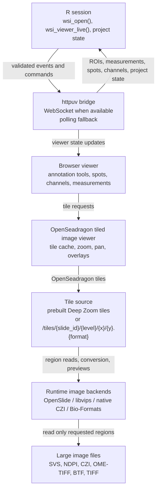

# Architecture Diagram

wsiTools has two viewer modes:

- Static HTML viewers are files opened by the browser. They can show tiles and
  annotations, but they do not automatically send new browser state back to R.
- Live viewers are connected to the active R session through a local `httpuv`
  service. They can synchronize annotations, selections, measurements,
  trajectories, channels, and project state back to R.

The important point is that the browser never reads raw SVS, CZI, OME-TIFF, or
other WSI files directly. It reads browser-friendly tiles. Those tiles can be
precomputed for static viewers or served on demand by the live R session.



## Why Static And Live Differ

`wsi_viewer()` writes an HTML viewer. It is useful for inspection and sharing,
but once opened as `file://...html`, there is no running R service attached to
the page. Browser actions remain in the browser unless exported manually.

`wsi_viewer_live()` starts a local `httpuv` server and opens an
`http://127.0.0.1:<port>/...` URL. The viewer sends only validated event types
to R, and R exposes session methods such as:

```r
viewer$get_rois()
viewer$get_selected_roi()
viewer$get_measurements()
viewer$get_segmentation()
viewer$get_channel_settings()
viewer$save_project("case_01.wsiproject")
```

## Why Tiles Are Required

Whole-slide images can be much larger than memory. OpenSeadragon expects tile
URLs, not raw WSI file paths. wsiTools therefore uses one of two approaches:

- Prebuilt tiles: libvips creates a Deep Zoom tile pyramid ahead of time. This
  is usually the smoothest option for static HTML viewers.
- Dynamic tiles: the live viewer exposes tile URLs and generates only the
  requested regions using OpenSlide, libvips, native CZI support, or
  Bio-Formats fallback when available.

Both approaches avoid loading the full slide into R memory by default.
