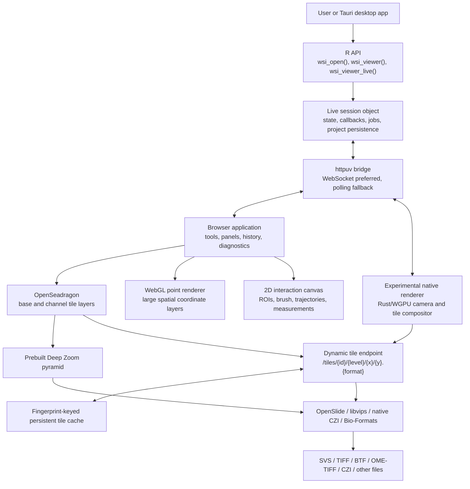

# wsiTools Architecture

This document describes how the R package, live browser viewer, image backends,
tile caches, spatial overlays, project state, and optional Tauri desktop app fit
together. It also records the performance rules that new code should preserve.

## Architectural Goals

wsiTools is designed around five constraints:

1. A whole-slide image must not be loaded into R memory as one level-0 bitmap.
2. The browser must receive tiles, not raw SVS, CZI, BTF, or OME-TIFF files.
3. The R package must remain installable without optional system backends.
4. Browser-to-R communication must use validated data events, never arbitrary R
   code sent by the browser.
5. An annotation, spatial coordinate, measurement, and image tile must remain in
   the original slide coordinate system regardless of zoom, pan, rotation, or
   multi-view layout.

These constraints explain why the package has a small R-facing core plus
optional runtime backends, a local live bridge, and more than one rendering
strategy.

## System Topology



The browser never directly decodes a raw WSI. OpenSeadragon requests a small
set of browser-readable JPEG or PNG tiles for the current viewport and zoom.

## Package Layers

The implementation is intentionally incremental rather than a separate viewer
rewrite.

| Layer | Responsibility | Main implementation |
| --- | --- | --- |
| Public R API | Open slides, construct viewers, read/write annotations, manage projects | `R/*.R` |
| Backend adapters | Metadata, pyramid levels, region reads, conversion | `R/backend-*.R`, `R/open.R` |
| Native acceleration | Optional CZI bridge and geometry indexing | `src/native-czi.cpp`, `src/native-geometry.cpp` |
| Tile subsystem | Static Deep Zoom, dynamic tiles, channel tiles, caching | `R/dynamic-tiles.R`, `R/viewer.R` |
| Live session | HTTP/WebSocket bridge, event validation, R session methods | `R/viewer-session.R` |
| Browser application | OpenSeadragon, tools, overlays, panels, analysis UI | generated by `R/viewer.R` |
| Native renderer (experimental) | Versioned tile manifest, camera, visible-tile selection, WGPU surface and staged viewer controls | `tools/wsiToolsDesktop/src-tauri/src/native_renderer.rs` |
| Project integration | Multi-image projects, spatial objects, state restoration | `R/viewer-project.R`, spatial adapters |
| Desktop launcher | File selection, R discovery, startup progress, native Save dialogs | `tools/wsiToolsDesktop` |

## Viewer Modes

### Static viewer

`wsi_viewer()` writes HTML. The page can use a preview or a precomputed Deep
Zoom pyramid and can export browser-side data, but no R process is attached
afterward. A `file://` page therefore has no automatic feedback to R.

Static mode is useful for a portable inspection artifact. Prebuilt tiles are
the preferred full-resolution source because a static page has no R tile
server.

### Live viewer

`wsi_viewer_live()` creates a `wsi_viewer_session`, starts a local `httpuv`
service, and writes a viewer configured with localhost endpoints. The same
service can provide:

- validated viewer-state events;
- R-to-browser commands;
- dynamic image and channel tiles;
- viewport-based dense annotation queries;
- on-demand spatial gene values;
- image export and project operations.

The R process must remain alive. WebSocket is used when available, with HTTP
POST and polling retained as a fallback.

### Desktop viewer

wsiTools Desktop is a Tauri wrapper around live mode. It locates `Rscript`,
starts the package launcher as a child process, opens a stable loading window,
and navigates that same window to the final viewer URL. The stable renderer is
still the browser/OpenSeadragon application. An experimental Rust/WGPU native
path is being introduced beneath the same live protocol: R exposes a compact
`/native-renderer` manifest, Rust owns native camera/tile selection and a WGPU
surface, and image pixels remain served by existing validated tile routes. This
allows a staged native migration without duplicating WSI decoding, analysis or
project state in Rust.

The launcher emits real startup stages:

1. `runtime`: start R and check wsiTools;
2. `metadata`: inspect image and project metadata;
3. `spatial`: load and map a spatial object when requested;
4. `tiles`: start tiled image and synchronization services;
5. `interactive`: show the tissue viewer;
6. `associated`: import annotations and associated data;
7. `ready`: finish startup.

Large associated annotation files are attached after the first viewer URL is
available. This keeps the initial image usable while background work continues.

## Slide And Project Data Model

A `wsi_slide` stores a path, backend identity, dimensions, pyramid information,
metadata, and backend-specific handles. It is a descriptor, not an in-memory
copy of all pixels.

A viewer project contains one or more project items. Each item can contain:

- one microscopy image;
- zero or more sections or scenes;
- tile-source metadata;
- navigator/preview metadata;
- physical scale metadata;
- image-specific annotation state;
- spatial or cell data scoped to that image and section;
- registered channel sources.

Project-scoped overlays carry an image/section key. This prevents a Seurat
layer, cell mask, ROI, or mIHC channel from leaking onto an unrelated tissue.

## Backend Selection

Backends are runtime capabilities. They are not all mandatory R package
dependencies.

| Backend | Typical role |
| --- | --- |
| OpenSlide | Fast region reads for supported pathology formats such as SVS |
| libvips | Metadata, conversion, pyramids, thumbnails, TIFF/BTF region work |
| Native CZI | CZI scene metadata and direct region/tile reads through libCZI |
| Bio-Formats | Broad microscopy-format fallback when a native reader is unavailable |
| ImageMagick | Ordinary-image fallback and limited previews |

The opening path records attempted backends and returns an actionable error when
none can read the source. `wsi_backends()` and `wsi_diagnose()` are the public
diagnostic entry points.

## Tile Architecture

### Prebuilt Deep Zoom

Prebuilt tiles are the fastest and most predictable path for repeatedly viewed
slides. libvips creates a pyramid once. OpenSeadragon subsequently reads static
files directly, so interaction does not wait for R to decode each tile.

Use this path when storage is available and the slide will be revisited or
shared as a static viewer.

### Dynamic tiles

Live mode can expose:

```text
/tiles/{slide_id}/{level}/{x}/{y}.{format}
```

For a cache miss, the server:

1. validates the source, level, row, column, format, and display settings;
2. converts the Deep Zoom request into a level-0 source region;
3. asks the active backend to read only that region;
4. resizes or colourises the region when required;
5. writes one JPEG or PNG tile;
6. returns the file and keeps it for reuse.

The complete slide is never materialized as one R image. Dynamic tiles are the
fallback for CZI scenes, virtual stain channels, or slides without a prebuilt
pyramid.

### Persistent cache

Desktop-created dynamic tile sources use a persistent cache by default. The
cache namespace includes:

- normalized source path;
- file size and modification time;
- backend and source kind;
- dimensions, page, scene, and channel;
- stain and tile settings;
- tile size, overlap, and format.

Changing the source file or relevant settings creates a new namespace, so a
tile from an older file cannot be silently reused. HTTP responses include an
`ETag`, immutable browser-cache headers, and `X-wsiTools-Tile-Cache: hit|miss`.
Conditional requests can return `304 Not Modified`.

The default persistent cache is under `tools::R_user_dir("wsiTools", "cache")`.
It is bounded to 20 GB by default and pruned by age and least-recently-modified
files. Users can inspect or manage it with:

```r
wsi_tile_cache_dir()
wsi_tile_cache_info()
wsi_tile_cache_prune()
wsi_tile_cache_clear()
```

Environment controls:

```text
WSITOOLS_DYNAMIC_TILE_CACHE_DIR
WSITOOLS_DYNAMIC_TILE_CACHE_GB
```

Temporary live sessions still use session-owned caches unless persistent
caching is explicitly enabled. Temporary caches and native CZI handles are
cleaned when the session stops.

### Browser tile policy

OpenSeadragon is configured for immediate rendering and no long cross-fade.
The browser keeps a bounded decoded-tile cache. Neighbor prefetch runs during
idle time, is cancelled when the viewport changes again, and is skipped during
active dragging or brush work. This avoids competing with the tile requests
needed for the visible viewport.

## Browser Rendering Stack

The browser uses separate rendering layers because one technology is not ideal
for every object.

1. **OpenSeadragon** renders the tiled base image and tiled channel overlays.
2. **WebGL** renders large spatial point layers such as Seurat, Giotto, or
   SpatialExperiment coordinates.
3. **2D canvas** renders editable ROIs, brush previews, trajectories,
   measurements, labels, selection handles, and small vector layers.
4. **HTML panels** render controls, legends, history, logs, jobs, and dialogs.

Large point layers upload coordinates, colours, and radii to GPU buffers. Pan
and zoom then update transform uniforms instead of asking JavaScript to redraw
every circle. Selected points remain on the interaction canvas so they can use
a clear selection halo.

The same WebGL strategy is used independently in every multi-view pane. Each
pane has its own OpenSeadragon viewport and WebGL context. The active pane uses
the live layer objects controlled by the side panel; inactive panes read their
own project image/section layer payload directly, without cloning it on every
frame. Shared non-project layers are added once. Buffer signatures include the
layer version and pane scope, preventing data from one tissue being rendered
in another.

Overlay draws are coalesced with `requestAnimationFrame()`. Repeated mouse or
tile events therefore schedule at most one overlay frame per browser frame.

## Spatial Coordinates

Spatial objects are converted into lightweight browser records containing only
the fields needed for display and selection. Full expression matrices remain
in R. Gene colouring requests one feature from R on demand and updates the
existing point colours rather than transferring every gene at startup.

For dense point layers, the renderer can apply level-of-detail sampling at low
zoom. Layers explicitly configured for full coordinates are not sampled. At
high zoom, contours and detailed styling can be restored without changing the
underlying coordinates.

Any manual registration edits are represented in slide-level coordinates and
can be synchronized back to R. Saving a full Seurat/Giotto/SpatialExperiment
object is an R-side operation; the browser only sends validated coordinate
updates and the requested output path.

## Dense Vector Annotations

Editable tissue ROIs remain vectors. Very large cell GeoJSON sources use a
different path:

1. R parses the source once;
2. bounding boxes are stored in a native C++ uniform-grid index;
3. the browser sends the visible slide bounds after pan/zoom settles;
4. R queries candidate boxes through the native index;
5. only intersecting features are returned;
6. an `AbortController` cancels an obsolete request when the viewport changes.

At low zoom the browser can hide or simplify dense cell geometry. At useful
zoom it requests full geometry only for the viewport. Multiple dense sources
receive distinct layer IDs, and every returned feature retains project scope.

The native index is an acceleration, not a semantic dependency. If the shared
library is unavailable, R falls back to exact R bounding-box filtering.

## Annotation Coordinate Invariants

All persistent geometry uses level-0 slide coordinates. Display coordinates are
derived at render time:

```text
slide coordinate -> image transform -> OpenSeadragon viewport -> canvas pixel
```

Pointer input follows the inverse path. Exported GeoJSON therefore does not
depend on the current zoom or browser dimensions.

Rotation and flips are display transforms. The base image and every associated
overlay must use the same effective transform. Multi-view panes perform the
same conversion using their own viewport.

Brush input is first treated as an area. The stroke path is buffered by brush
radius, accumulated as a binary selection region, then converted to a boundary.
Geometry simplification must be tied to screen-space tolerance so it reduces
redundant points without changing the visible contour.

## Multi-View Architecture

Multi-view creates one OpenSeadragon instance per occupied pane. Pan and zoom
are independent by default. Optional synchronization copies viewport state only
after applying the same coordinate conversion, so sensitivity remains
consistent.

Each pane owns:

- one base-image OpenSeadragon instance;
- optional tiled channel items;
- one WebGL spatial overlay;
- one 2D interaction canvas;
- independent ruler state and screenshot composition;
- an image/section assignment.

Blank custom panes stay blank. Dragging a project item replaces only the target
pane. A project image cannot be duplicated into another pane unless the layout
explicitly permits that behavior.

## Live Transport And Security

The live bridge accepts a fixed allowlist of event names. Payload fields are
also validated. Unsupported events or fields are rejected and recorded in the
viewer log instead of being evaluated.

The browser cannot send R expressions, function bodies, shell commands, or
arbitrary output paths to general-purpose evaluators. R-to-browser operations
are similarly represented as typed commands such as `add_rois`, `add_layer`, or
`set_channel_settings`.

WebSocket is preferred because it provides low-latency bidirectional updates.
Polling remains available when a browser, proxy, or environment does not permit
WebSocket transport.

## Session And Project State

The `wsi_viewer_session` object is the R-side boundary. It exposes methods such
as:

```r
viewer$get_state()
viewer$get_rois()
viewer$get_selected_roi()
viewer$get_measurements()
viewer$get_layers()
viewer$get_channel_settings()
viewer$get_performance()
viewer$add_rois(rois)
viewer$add_layer(layer)
viewer$save_project("case_01.wsiproject")
```

Project persistence can include slide paths, project image/section identity,
annotations, selected IDs, layers, segmentation, measurements, trajectories,
stain and channel settings, tile-source metadata, viewport state, tile
manifests, and provenance. Restoring state must resolve data by stable IDs and
project scope rather than by current list position alone.

## Performance Telemetry

The View menu exposes a performance summary and a copyable report. The viewer
tracks:

- time until the image opens;
- time until the first tile;
- loaded, drawn, and failed tile counts;
- overlay frame count, average time, and maximum time;
- dense-annotation request count, average time, cancellations, and failures;
- active renderer (`canvas` or `webgl`);
- tile cache mode;
- multi-view pane count.

The same payload is synchronized to R:

```r
viewer$get_performance()
```

Performance reports belong in bug reports because they distinguish slow source
decoding from slow network delivery or slow overlay rendering.

## Memory And Concurrency Rules

New implementations should follow these rules:

- Read one region or tile at a time; never decode the entire WSI for viewing.
- Bound browser tile caches and persistent disk caches.
- Keep expression matrices and high-dimensional measurements in R.
- Transfer only display fields or one requested feature to the browser.
- Cancel stale viewport and prefetch work.
- Build reusable GPU or native indexes once, not on every frame.
- Avoid synchronous annotation parsing before the first useful viewer URL when
  the data can be attached afterward.
- Never start an unbounded number of external converter processes.

## Failure And Recovery Paths

| Failure | Expected behavior |
| --- | --- |
| Preferred backend unavailable | Try the next compatible backend and report all attempts |
| Dynamic tile generation fails | Log source, level, row, column, URL, and backend error |
| WebGL unavailable | Fall back to 2D canvas and record one warning |
| WebSocket unavailable | Continue through polling |
| Dense viewport request superseded | Abort it silently and request the current viewport |
| Associated annotation import fails | Keep the base image usable and retain the error in Logs |
| Browser refresh with unsaved work | Restore autosave when possible or warn before replacement |
| Persistent cache becomes stale | File fingerprint selects a new namespace |
| Native bbox index unavailable | Use exact R filtering |

Errors and warnings should appear in the persistent Logs/History UI, not only
as short-lived toasts.

## Implemented Performance Improvements

The current architecture includes:

- fingerprinted persistent dynamic tiles with bounded pruning;
- HTTP ETag and immutable tile responses;
- cancellable idle tile prefetch;
- real desktop startup stages;
- delayed associated annotation import;
- native C++ viewport indexing for dense polygons;
- abortable viewport annotation queries;
- WebGL spatial points in single and multi-view modes;
- animation-frame coalescing for overlay redraws;
- copyable browser/R performance diagnostics.

## Recommended Next Work

The highest-value remaining work is deliberately narrower than a viewer
rewrite:

1. **Two-phase spatial startup.** Open the base image before deserializing very
   large Seurat/Giotto/SpatialExperiment objects, then attach the spatial layer
   through the live session.
2. **Backend worker queue.** Use a small bounded pool for expensive dynamic tile
   decodes so one slow CZI request cannot block every other visible tile.
3. **Prebuilt-pyramid promotion.** Generate a Deep Zoom pyramid in the
   background after repeated dynamic use and switch future sessions to it.
4. **Screen-space annotation cache.** Cache stable ROI paths until viewport or
   geometry versions change, while keeping edit previews on the live canvas.
5. **Viewport point index for selection.** Keep GPU rendering, but use a native
   or typed-array spatial index for hit-testing and lasso selection of millions
   of points.
6. **Performance budgets in CI.** Add browser smoke tests that fail when startup,
   frame time, or dense-query counts regress beyond agreed thresholds.
7. **Crash recovery journal.** Persist compact annotation operations between
   full project saves so a browser or desktop crash can replay recent edits.

## Verification Strategy

Unit tests cover tile URL parsing, cache namespaces, ETag responses, event
allowlists, WebSocket fallback, channel settings, project-state round trips,
native bbox indexing, and generated viewer hooks.

Generated viewer JavaScript is parsed as JavaScript in tests. Browser smoke
tests should additionally verify:

- first tile and full-resolution zoom;
- pan/zoom without black flashes;
- spatial points in single and multi-view panes;
- project-scoped layers after changing tissue;
- ROI creation/edit/undo/export;
- dense annotation appearance after zoom;
- screenshot composition;
- live WebSocket and polling state updates;
- desktop progress-to-viewer navigation.

Run the R suite with:

```sh
Rscript -e 'devtools::test()'
R CMD build .
R CMD check --as-cran wsiTools_*.tar.gz
```

Build the desktop components with:

```sh
cd tools/wsiToolsDesktop
npm run build:ui
cd src-tauri
cargo check
```
