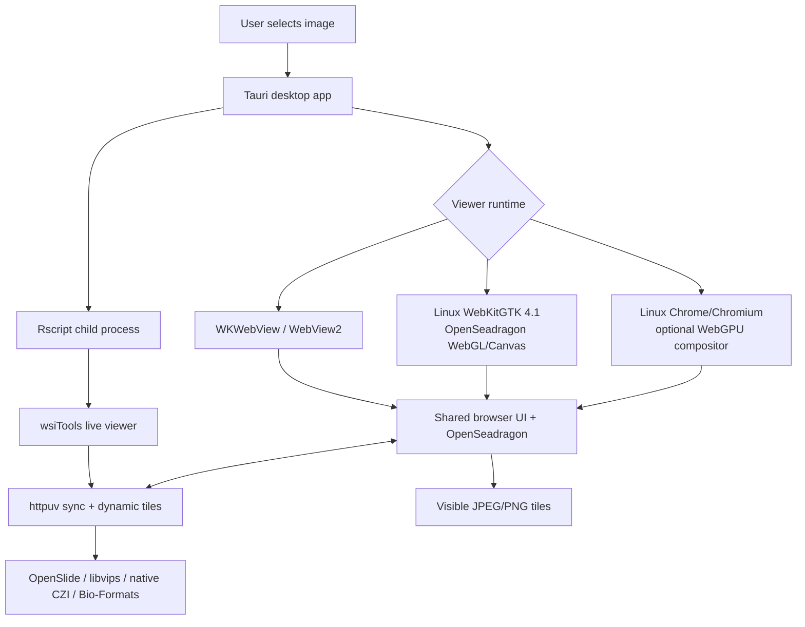

# Desktop App

wsiTools includes an optional Tauri desktop launcher in
`tools/wsiToolsDesktop`. It is intended for users who are not familiar with R.

The desktop app opens a file picker, starts R in the background, runs
`wsi_open_viewer()` in live mode, and displays the synchronized viewer inside a
desktop window.

Image preparation progress remains in the starter window. The separate tissue
viewer opens only after R has decoded a display-ready first image; if decoding
fails, the starter reports the backend error instead of opening a blank viewer.

### Linux GPU viewer

The Linux desktop has two browser-runtime roles. WebKitGTK 4.1 is required by
Tauri for the starter window, file-selection workflow and R process controls.
WebKitGTK provides accelerated WebGL compositing but may not expose the WebGPU
API even when the machine has a supported GPU. wsiTools Desktop therefore
looks for Google Chrome or Chromium when the final viewer URL is ready and, if
found, opens that same localhost application in a dedicated Chrome application
window using the browser's supported hardware-acceleration defaults.

The handoff changes only the browser runtime. It does not create a second
viewer implementation: the HTML/JavaScript UI, OpenSeadragon viewport, live R
process, WebSocket connection, tile endpoints and project state are identical.
OpenSeadragon WebGL is the stable default tile renderer and remains the pyramid
and navigation controller. WebGPU composition is experimental and is used only
when the user explicitly sets `WSITOOLS_TILE_COMPOSITOR=webgpu` or `auto`.
wsiTools never launches Chrome with `--enable-unsafe-webgpu`, forced Vulkan, or
GPU-blocklist overrides.

Install one of these browsers for the most predictable Linux viewer window.
wsiTools verifies that the browser process remains alive before closing the
temporary loading window; an early browser exit falls back automatically to
WebKitGTK. The viewer's History report records the active renderer.

Check and install the Linux starter runtime from R:

```r
wsi_install_desktop_dependencies(install = FALSE)
wsi_install_desktop_dependencies(install = TRUE, allow_sudo = TRUE)
```

Use `build = TRUE` only when compiling the Tauri application from source. The
prebuilt `.deb` already declares WebKitGTK. Portable AppImage users should
install `libwebkit2gtk-4.1-0`, `libcanberra-gtk-module`, and
`libcanberra-gtk3-module` on Ubuntu. A missing canberra module affects desktop
sound integration, not image decoding, but installing it removes the warning.

## Viewer Engine

The desktop app has one supported viewer implementation: the complete browser
application controlled by OpenSeadragon and synchronized with R. Depending on
the platform and capabilities, it runs in WKWebView, WebView2, WebKitGTK or a
Chrome/Chromium application window. There is no separate native Rust/WGPU
viewer to select.

OpenSeadragon always owns pyramid geometry, visible-tile selection, pan, zoom,
navigator state and coordinate conversion. Its WebGL drawer is the normal GPU
path, with Canvas as a CPU-compatible fallback. When `navigator.gpu` and a GPU
device are available, the optional WebGPU compositor can draw visible base and
channel tiles. WebAssembly is independent: it accelerates CPU-side viewport
culling for large static annotation collections.

No expression matrix, complete whole-slide bitmap or arbitrary R command is
sent to the desktop process. Image decoding and analyses remain in R and its
runtime backends; the viewer receives viewport tiles and typed state updates.

## Download

Prebuilt desktop installers are available from the GitHub release:

[Download wsiTools Desktop 0.1.9](https://github.com/tkcaccia/wsiTools/releases/tag/desktop-v0.1.9)

See [Desktop Downloads](downloads.md) for platform-specific installers,
required R setup, and optional backend notes.

```sh
cd tools/wsiToolsDesktop
npm install
npm run dev
```

For platform-specific build instructions and distributable installers, see
[Compile the Tauri Desktop App](tauri-build.md).

The user workflow is:

1. Click **Select image**.
2. Choose an SVS, TIFF, OME-TIFF, CZI, or other supported image.
3. Click **Open live viewer**.
4. Annotate, measure, inspect tiles, or use other viewer tools.
5. Click **Stop R** when finished.

The R process must stay open while the viewer is used. It owns the live
`httpuv` synchronization endpoint and any dynamic tile server.

## Startup And Cache Behavior

The starter reports real stages from R: runtime, metadata, spatial mapping,
tiles, interactive image, associated data, and ready. It does not expose the
viewer window until a decoded navigator/tissue preview is available. The
preview remains visible beneath OpenSeadragon until full-resolution tiles take
over, preventing a blank first frame without loading the whole slide into RAM.

Desktop live viewers enable persistent dynamic tiles. Reopening the same
unchanged image can therefore reuse tiles generated by a previous session. The
cache key includes source path, size, modification time, scene/page/channel,
and tile settings. Manage the cache from R with:

```r
wsi_tile_cache_info()
wsi_tile_cache_prune()
wsi_tile_cache_clear()
```

Large annotation files are attached after the base viewer is interactive. A
failed annotation import should leave the microscopy image usable and record
the error in the viewer Logs panel and desktop R log.

## R Setup

On first launch, the app searches for `Rscript` in this order:

1. `WSITOOLS_RSCRIPT`;
2. the environment `PATH`;
3. `R_HOME`;
4. common R installation folders for macOS, Windows, and Linux.

If R is not found, the first window shows a **Download R** button linking to
CRAN. After installing R, restart the app.

The app expects R and wsiTools to be available:

```r
remotes::install_github("tkcaccia/wsiTools", upgrade = "never")
install.packages("httpuv")
library(wsiTools)
wsi_backends()
```

If the app cannot find R, set `WSITOOLS_RSCRIPT` to the full path of
`Rscript`.

## Architecture



The desktop app is an optional wrapper. It does not replace the R package API,
and it does not make OpenSlide, libvips, CZI or Bio-Formats mandatory package
dependencies. WebKitGTK is required only by the Linux Tauri shell. Chrome or
Chromium is optional and changes the browser runtime, not the R/tile
architecture.
