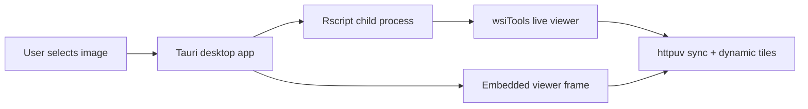

# Desktop App

wsiTools includes an optional Tauri desktop launcher in
`tools/wsiToolsDesktop`. It is intended for users who are not familiar with R.

The desktop app opens a file picker, starts R in the background, runs
`wsi_open_viewer()` in live mode, and displays the synchronized viewer inside a
desktop window.

## Viewer Engine

Before a new project starts, the desktop starter lets the user select one of
two front ends for the same live R session:

| Choice | Use |
| --- | --- |
| Browser viewer | The full OpenSeadragon viewer, including all established tools. |
| Native Rust/WGPU | Experimental native GPU window. It receives only visible tiles and state snapshots from R; it does not load the whole slide or expression matrix. |

The native renderer is a staged replacement and does not yet provide every
OpenSeadragon workflow. Select **Browser viewer** for any tool that is not yet
available natively. Restart the desktop app after an update if the engine
selector is not shown.

Current native controls include independent slide/pane navigation, linked or
unlinked multi-view navigation, editable polygon and brush ROIs, trajectories,
distance measurements, GeoJSON import/export, project saving, visible-tile
channel layers, and GPU brightfield display modes (**Original H&E**,
**Hematoxylin**, **Eosin**, and **Residual**). The stain modes run per visible
tile on the GPU; no whole-slide image is copied into R or GPU memory.

The native **Stains** menu also provides browser-equivalent base-image controls:
show or hide the H&E/base image and set opacity from fully transparent to fully
opaque. These values are synchronized to the live R state and preserved by a
saved project.

Native **View -> Multi-view** supports the same 1--12 pane range as the browser
viewer. New panes are intentionally blank: select a pane, then select a slide
from **Project**. This avoids silently duplicating a tissue in two panes.
Spatial coordinate colours can be restored after gene/cluster colouring, and
**Spatial -> Coordinate size** changes the displayed radius without changing
the R-side coordinates.

The native **Project** menu can save or restore a `.wsiproject` directory.
Restoring delegates to R's existing project-state reader, preserving the same
annotations, trajectories, measurements, layers, stain/channel settings, and
source-scoped native state as the browser viewer. The current live session must
still be able to access the original slide files referenced by that project.

Use **View -> Save screenshot...** in the native window to export a PNG of the
current tissue view, including visible image channels and scientific overlays
but excluding temporary application panels and menus.

Use **View -> Export full-resolution viewport...** or **Export selected ROI
image...** when the output must contain original level-0 pixels rather than a
screen capture. The native window opens the normal save dialog and sends the
chosen TIFF, PNG, or JPEG path plus the bounded source region to R. R reads and
writes only that region through the configured image backend; the full slide
is never transferred to the desktop process.

The native window can also be launched directly from R:

```r
library(wsiTools)
wsi_viewer_native("/path/to/slide.svs", dynamic_tiles = TRUE)
```

### Native Cells Workflow

Start the native session with the optional selected-ROI segmentation bridge:

```r
wsi_viewer_native(
  "/path/to/slide.svs",
  dynamic_tiles = TRUE,
  stardist = TRUE
)
```

The native **Cells** menu then appears when the live R endpoint is available.
Select an existing ROI, choose **StarDist H&E**, **StarDist IHC**, or **Mesmer
DAPI**, and run that ROI. R executes the configured backend; the native viewer
receives only the resulting geometry and renders it as a read-only cell overlay.

Use **Cells -> Import cell segmentation...** to load a precomputed GeoJSON,
CSV/TSV centroid table, or image mask. The native app sends only the selected
file path to the local R bridge. R detects the format and keeps a large
segmentation indexed server-side, returning only geometry intersecting the
visible viewport.

### Native Spatial Analysis

For live Seurat, Giotto, SpatialExperiment, or CellPhenotyper projects, the
native window exposes the same R-owned analytical endpoints as the browser
viewer:

- **Annotations -> Associate spatial points/cells** assigns the current
  points or cells to tissue ROIs in R.
- **Analysis -> Proximity analysis** measures nearest-neighbour
  distances between selected ROI categories or individual ROIs.
- **Analysis -> Proximity analysis -> Run statistics** bins those distances and asks R
  to correlate an eligible expression feature, PCA/reduction component, or
  prediction value with distance. The native table accepts both conventional
  row tables and R data frames serialized as named columns; select a feature
  in the table to colour the visible spatial circles from the live R session.
- **Analysis -> Trajectory -> Run profile** profiles a selected
  point/cell source across a selected trajectory. Choose a numeric field,
  categorical field, or `count`, then choose the width and number of bins. R
  evaluates the complete source layer after any active spatial registration;
  the native renderer receives only bin summaries plus colours for points in
  the current viewport. Results remain available through
  `viewer$get_trajectory_profile()`.
- **Prediction** runs PLS-LDA through optional `fastPLS`; selected annotations
  provide training labels and all non-training points are predicted. The
  native renderer then refreshes only visible coordinate circles with the R
  prediction colours.
- **Spatial registration** provides global move, independent X/Y scale,
  rotation, and horizontal/vertical flip controls. R applies the compact
  transform before viewport clipping, so the native GPU receives only the
  registered points currently needed on screen.

Native annotations support polygon drawing, paint-brush ROIs, selection, class
and colour changes, deletion, GeoJSON import/export, and direct boundary
editing. Double-click an ROI, choose **Annotations -> Edit selected ROI**,
then drag a visible polygon vertex. The edited feature is sent back to R as one
validated `roi_updated` event on mouse release. Large GeoJSON files are kept as
indexed vector geometry in R and fetched only for the visible viewport; small
imports remain editable ROI objects.

For a CellPhenotyper project that contains GrandQC outputs, the native window
also shows **Artifacts**. Choose one GrandQC file or **Load all GrandQC files**.
The selected paths, rather than their potentially large GeoJSON payloads, are
sent to R; R tags the imported ROIs as `GrandQC` and the native renderer then
uses its usual editable-ROI or viewport-only rendering path. **Clear GrandQC
annotations** removes only those tagged artifact objects and leaves user ROIs
unchanged.

No expression matrix, whole-slide image, or arbitrary R command is sent to
the desktop process. These menus appear only when the live R session
advertises an eligible analysis context.
The result remains in the live R session and is included in saved projects.

This starts the same local `httpuv` session and opens the installed desktop
renderer. Set `WSITOOLS_DESKTOP_APP` or pass `app_path` to use a non-default
desktop executable.

## Download

Prebuilt desktop installers are available from the GitHub release:

[Download wsiTools Desktop 0.1.5](https://github.com/tkcaccia/wsiTools/releases/tag/desktop-v0.1.5)

See [Desktop Downloads](downloads.md) for platform-specific installers,
required R setup, and optional backend notes.

```sh
cd tools/wsiToolsDesktop
npm install
npm run dev
```

For platform-specific build instructions and distributable installers, see
[Compile the Tauri Desktop App](tauri-build.md).

The user workflow is:

1. Click **Select image**.
2. Choose an SVS, TIFF, OME-TIFF, CZI, or other supported image.
3. Click **Open live viewer**.
4. Annotate, measure, inspect tiles, or use other viewer tools.
5. Click **Stop R** when finished.

The R process must stay open while the viewer is used. It owns the live
`httpuv` synchronization endpoint and any dynamic tile server.

## Startup And Cache Behavior

The viewer window opens immediately and reports real stages from R: runtime,
metadata, spatial mapping, tiles, interactive image, associated data, and
ready. It no longer uses a simulated progress animation.

Desktop live viewers enable persistent dynamic tiles. Reopening the same
unchanged image can therefore reuse tiles generated by a previous session. The
cache key includes source path, size, modification time, scene/page/channel,
and tile settings. Manage the cache from R with:

```r
wsi_tile_cache_info()
wsi_tile_cache_prune()
wsi_tile_cache_clear()
```

Large annotation files are attached after the base viewer is interactive. A
failed annotation import should leave the microscopy image usable and record
the error in the viewer Logs panel and desktop R log.

## R Setup

On first launch, the app searches for `Rscript` in this order:

1. `WSITOOLS_RSCRIPT`;
2. the environment `PATH`;
3. `R_HOME`;
4. common R installation folders for macOS, Windows, and Linux.

If R is not found, the first window shows a **Download R** button linking to
CRAN. After installing R, restart the app.

The app expects R and wsiTools to be available:

```r
remotes::install_github("tkcaccia/wsiTools", upgrade = "never")
install.packages("httpuv")
library(wsiTools)
wsi_backends()
```

If the app cannot find R, set `WSITOOLS_RSCRIPT` to the full path of
`Rscript`.

## Architecture



The desktop app is an optional wrapper. It does not replace the R package API,
and it does not make OpenSlide, libvips, CZI, Bio-Formats, StarDist, or Mesmer
mandatory package dependencies.
