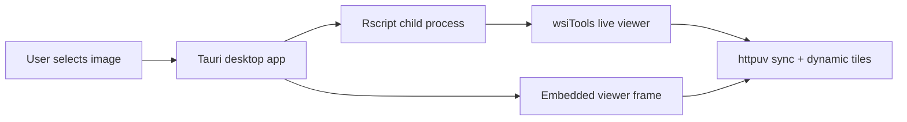

# Desktop App

wsiTools includes an optional Tauri desktop launcher in
`tools/wsiToolsDesktop`. It is intended for users who are not familiar with R.

The desktop app opens a file picker, starts R in the background, runs
`wsi_open_viewer()` in live mode, and displays the synchronized viewer inside a
desktop window.

## Download

Prebuilt desktop installers are available from the GitHub release:

[Download wsiTools Desktop 0.1.1](https://github.com/tkcaccia/wsiTools/releases/tag/desktop-v0.1.1)

See [Desktop Downloads](downloads.md) for platform-specific installers,
required R setup, and optional backend notes.

```sh
cd tools/wsiToolsDesktop
npm install
npm run dev
```

For platform-specific build instructions and distributable installers, see
[Compile the Tauri Desktop App](tauri-build.md).

The user workflow is:

1. Click **Select image**.
2. Choose an SVS, TIFF, OME-TIFF, CZI, or other supported image.
3. Click **Open live viewer**.
4. Annotate, measure, inspect tiles, or use other viewer tools.
5. Click **Stop R** when finished.

The R process must stay open while the viewer is used. It owns the live
`httpuv` synchronization endpoint and any dynamic tile server.

## R Setup

On first launch, the app searches for `Rscript` in this order:

1. `WSITOOLS_RSCRIPT`;
2. the environment `PATH`;
3. `R_HOME`;
4. common R installation folders for macOS, Windows, and Linux.

If R is not found, the first window shows a **Download R** button linking to
CRAN. After installing R, restart the app.

The app expects R and wsiTools to be available:

```r
remotes::install_github("tkcaccia/wsiTools", upgrade = "never")
install.packages("httpuv")
library(wsiTools)
wsi_backends()
```

If the app cannot find R, set `WSITOOLS_RSCRIPT` to the full path of
`Rscript`.

## Architecture



The desktop app is an optional wrapper. It does not replace the R package API,
and it does not make OpenSlide, libvips, CZI, Bio-Formats, StarDist, or Mesmer
mandatory package dependencies.
